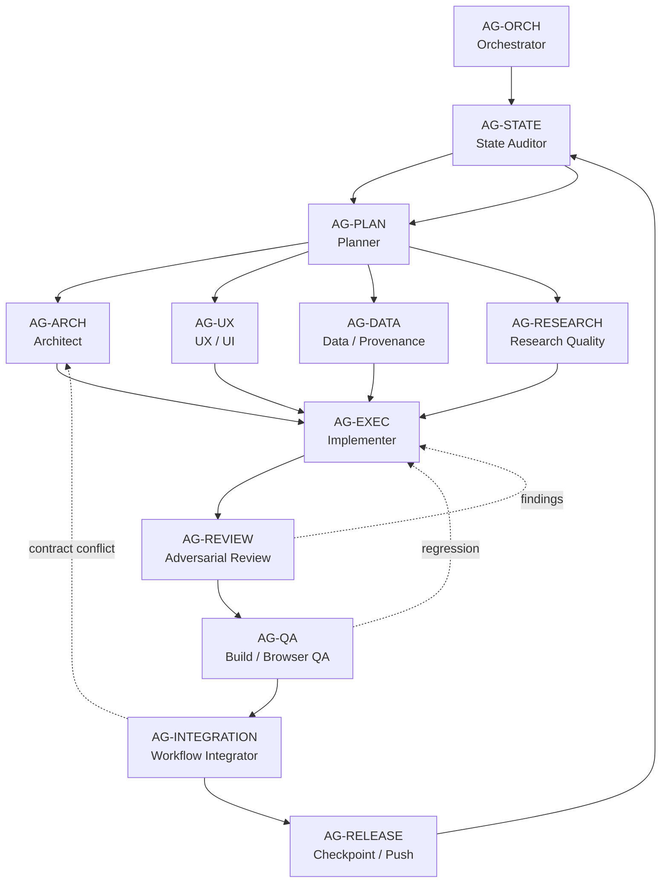

# 学森 Agent Dependency Graph

这是 Graph Engineering 的执行层：它固化 Agent 之间的依赖、并行关系、交付物和失败回退路径，让 Codex 可以围绕一个目标持续迭代，而不是每次重新临时决定“该叫谁做什么”。

项目状态和模块关系仍由 [`GRAPH_ENGINEERING.md`](./GRAPH_ENGINEERING.md) 描述；本文件回答的是另一个问题：**哪个 Agent 在什么条件下启动，输出交给谁，失败后回到哪里。**

机器可读版本：[`agent-dependency-graph.json`](./agent-dependency-graph.json)

可变的跨轮次 checkpoint：[`agent-run-state.json`](./agent-run-state.json)。拓扑图保持稳定，run state 记录当前目标、活跃 Agent、产物、finding 和下一跳。

## 直接调用

在 Codex 中使用：

```text
按 Agent Dependency Graph 继续学森。
目标：<本轮目标>
先读取 docs/AGENT_DEPENDENCY_GRAPH.md、docs/agent-dependency-graph.json 和 docs/GRAPH_ENGINEERING.md；恢复上一次 run state，只启动当前依赖已满足的 Agent，完成验证后更新 state 并进入下一轮。
```

如果目标明确，也可以指定入口：

```text
按 Agent Dependency Graph 推进目标“完成图谱到证据锚点的回读闭环”，从当前未阻塞节点开始，允许独立的 UX、数据契约和研究质量分析并行，最后必须经过 review、QA 和 integration gate。
```

## Agent 拓扑



`AG-ARCH`、`AG-UX`、`AG-DATA`、`AG-RESEARCH` 在互不写同一文件且输入相互独立时可以并行；`AG-EXEC` 是实现汇合点；`AG-REVIEW`、`AG-QA`、`AG-INTEGRATION` 是不可跳过的质量门。

## Agent 合同

| Agent | 负责的问题 | 必须输出 | 默认失败回退 |
|---|---|---|---|
| `AG-ORCH` | 本轮目标、范围和停止条件是什么 | `runState`、目标声明、节点选择 | `AG-STATE` |
| `AG-STATE` | 当前代码、文档、分支和上轮证据是什么 | 状态快照、已完成/未完成/阻塞节点 | `AG-PLAN` |
| `AG-PLAN` | 目标如何拆成有依赖的最小任务 | task DAG、触点、验收和验证门 | `AG-ARCH` |
| `AG-ARCH` | 数据/路由/边界是否成立 | contract delta、迁移/回滚决策 | `AG-PLAN` |
| `AG-UX` | 用户路径、层级、响应式和动效是否成立 | UI contract、状态矩阵、浏览器场景 | `AG-EXEC` |
| `AG-DATA` | 证据、locator、持久化和失效传播是否可信 | schema/store/db 方案、数据不变量 | `AG-ARCH` |
| `AG-RESEARCH` | 输出是否真的服务科研判断 | 研究质量标准、反例/矛盾检查 | `AG-PLAN` |
| `AG-EXEC` | 如何在现有边界内落地 | 代码、迁移、聚焦测试、变更说明 | `AG-REVIEW` |
| `AG-REVIEW` | 实现是否有 bug、回归、越权或证据漏洞 | 严重度排序的 findings | `AG-EXEC` |
| `AG-QA` | 构建、类型、交互和视口是否通过 | 可复现验证证据 | `AG-EXEC` |
| `AG-INTEGRATION` | 多模块是否形成完整用户闭环 | 集成报告、遗留风险、下一节点 | `AG-ARCH` 或 `AG-EXEC` |
| `AG-RELEASE` | 结果是否可追踪、可恢复、可继续 | commit、push、run checkpoint、graph update | `AG-STATE` |

每个 Agent 都必须收到 `runId`、`objective`、`nodeId`、`ownership`、`reads`、`writes`、`dependsOn` 和 `acceptance`。没有明确 ownership 的 Agent 不得修改共享文件。

## 依赖和并行规则

依赖边使用以下语义：

- `requires`：目标 Agent 不能启动，直到来源 Agent 输出满足 exit criteria。
- `parallel`：两条边可同时运行，但不能拥有相同的写文件范围。
- `handoff`：来源输出作为目标输入，必须写入 artifact 路径或 run state。
- `review_loop`：发现问题后回到实现节点，保留 finding 和尝试次数。
- `replan`：发现目标或架构假设失效，回到 Planner/Architect，不允许实现 Agent 自行扩大范围。
- `checkpoint`：写入可恢复的状态和验证证据，允许下一轮继续。

默认启动顺序：

```text
ORCH → STATE → PLAN
             ├─ ARCH ─┐
             ├─ UX ───┤
             ├─ DATA ─┤→ EXEC → REVIEW → QA → INTEGRATION → RELEASE
             └─ RESEARCH ┘                 ↘ failure → EXEC
```

有以下情况时不得并行：

- 两个 Agent 要修改同一个 Store、类型文件、路由配置或数据库迁移。
- 后一个 Agent 的问题定义依赖前一个 Agent 尚未稳定的结论。
- 一个 Agent 会改变另一个 Agent 的验收标准。

## 持续迭代协议

一次 run 不是“一次执行完就结束”，而是一个可回到图上的闭环：

1. `AG-ORCH` 创建或恢复 [`agent-run-state.json`](./agent-run-state.json)，锁定本轮 objective 和 scope。
2. `AG-STATE` 读取代码、最近提交、Graph Engineering 项目图和上一轮验证证据。
3. `AG-PLAN` 只生成能在当前合同下执行的 task DAG，并标出可并行 lanes。
4. 规划节点完成后，启动未阻塞的专业 Agent；所有输出都写入 artifact 或 state，不依赖聊天上下文记忆。
5. `AG-EXEC` 汇合实现；完成后必须经过 `REVIEW → QA → INTEGRATION`。
6. 验证失败时：代码缺陷回 `EXEC`，契约冲突回 `ARCH`，目标歧义回 `PLAN`，研究质量问题回 `RESEARCH`。
7. `AG-RELEASE` 只在所有 gate 通过后提交、push、更新两张图和 `PROGRESS.md`，再把新解锁节点写入 `next`。
8. 若 objective 尚未完成，`AG-STATE` 创建下一轮 checkpoint；若完成，记录 terminal evidence，不再无目的地产生新任务。

## Run State 合同

每轮至少保存：

```json
{
  "runId": "run_2026-08-02_kg05",
  "objective": "完成图谱到证据锚点的回读闭环",
  "active": ["AG-EXEC"],
  "done": ["AG-ORCH", "AG-STATE", "AG-PLAN", "AG-ARCH", "AG-DATA"],
  "blocked": [],
  "attempts": {"AG-EXEC": 1},
  "artifacts": ["docs/graph-engineering.json"],
  "findings": [],
  "lastVerification": ["npm run build", "npm run lint"],
  "next": ["AG-REVIEW"]
}
```

状态必须能让新 Agent 在没有本轮聊天历史的情况下恢复：当前目标、正在执行的节点、输出位置、失败原因、验证结果和下一跳都不能只存在于对话中。完成一轮后更新这个文件，并在需要时把已验证的结构变化同步回拓扑图。

## 完成和停止条件

只有满足以下条件才进入 `RELEASE`：

- 目标 acceptance 已逐项验证。
- Review 没有未处理的高严重度 finding。
- Build/type/lint 和与风险匹配的浏览器或数据验证已运行并读取结果。
- Graph Engineering 项目图的节点状态、依赖和证据已更新。
- 未引入第二份事实源，未跨越外部检索、TeX、写作替代等 deferred boundary。

需要用户决定时停止并记录 `blocked`，而不是让 Agent 猜测。可恢复的实现问题则继续走回退边，直到通过或明确阻塞。
