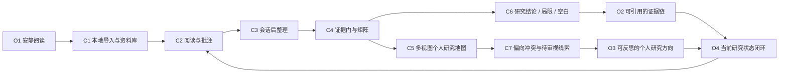
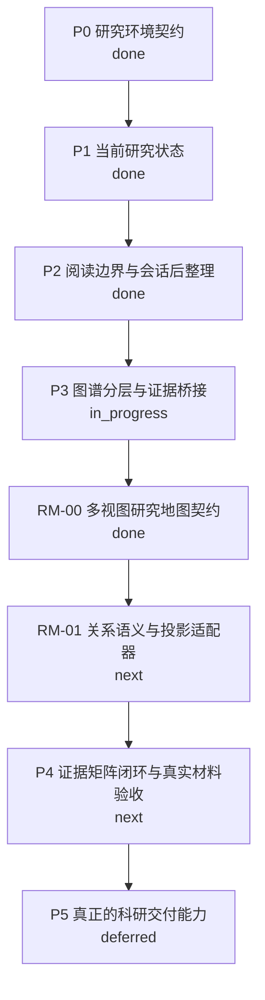
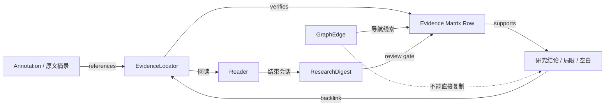

# 学森 Graph Engineering

> Graph Engineering 由项目上下文图和一个可选的 Codex-local Agent 执行覆盖层组成。本文件固化项目目标、工作流、代码触点和验证状态；Agent 覆盖层只保留在本地，不进入远端仓库。

Agent 图是执行入口，项目图是执行上下文。它们都不是论文知识图谱，也不是 `graphify` 的代码扫描结果。

机器可读版本：[`docs/graph-engineering.json`](./graph-engineering.json)
本地 Agent 图文件（若存在）：`docs/AGENT_DEPENDENCY_GRAPH.md`、`docs/agent-dependency-graph.json`

## 直接调用

在 Codex 中可以直接说：

```text
按 Graph Engineering 继续学森：先读取本地存在的 Agent 图和 `docs/agent-run-state.json`，再读取 `docs/GRAPH_ENGINEERING.md` 和 `docs/graph-engineering.json` 作为项目上下文；只启动当前依赖已满足的 Agent，完成 review/QA/integration 后更新本地 Agent 图和项目图。
```

也可以指定节点：

```text
按 Graph Engineering 执行 KG-05：把图谱节点桥接到证据锚点和原文回读，先检查它的 depends_on 和 acceptance，再实现和验证。
```

当前研究环境闭环的 Agent 推进 DAG、双 QA 门和可直接复制的调用模板见
[`docs/AGENT_DEPENDENCY_GRAPH.md`](./AGENT_DEPENDENCY_GRAPH.md) 的“研究环境推进图”。
其中 `AG-QA` 必须分别记录静态/数据门和浏览器/真实文档门；浏览器不可用时，
浏览器门保持 `blocked`，不能用静态检查替代集成验收。

每次迭代都遵守同一顺序：

1. 读取 JSON 图和相关 sourceOfTruth 文档。
2. 用代码、现有测试和浏览器状态确认节点是真正的 `done`、`in_progress`、`next` 还是 `blocked`。
3. 只选择依赖已满足的最高优先级 `next` 节点；若用户明确指定节点，则先检查它是否跨越硬边界。
4. 完成实现、迁移、验证和文档状态更新；不要只把节点标成完成。
5. 把新增依赖、失效路径、验证结果和下一节点写回 JSON 图及相关计划文档。

## 产品目标图



核心叙事是：研究者负责搜索后导入、阅读和判断；环境负责整理、关联、核验提示和回读路径。资料图谱提供导航线索，论证视图解释关系，证据矩阵是可引用材料的唯一核验入口。

## 工程分层

| 层 | 节点职责 | 当前事实来源 | 允许的边 | 不允许的行为 |
|---|---|---|---|---|
| Outcome | 产品结果和用户价值 | `.omx/specs/`、README、验收标准 | `produces`、`measured_by` | 直接改代码 |
| Workflow | 导入 → 阅读 → 整理 → 证据 → 图谱 → 反思 | `.omx/plans/`、`PROGRESS.md` | `depends_on`、`bridges_to` | 绕过证据门 |
| Capability | 可交付能力和阶段 | `docs/plans/`、`src/features/` | `implemented_by`、`blocked_by` | 只做孤立 UI |
| Data | 类型、Store、DB 和 locator | `src/types/`、`src/stores/`、`src/db/` | `persists`、`invalidates`、`references` | 复制第二份事实源 |
| Surface | 路由、页面、Reader、Inspector | `src/App.tsx`、`src/features/` | `navigates_to`、`returns_to` | 破坏现有 URL/ID 合同 |
| Verification | 构建、lint、浏览器和证据探针 | `package.json`、`scripts/`、计划验收 | `verifies` | 只凭截图或编译通过宣称完成 |
| Boundary | 明确延后或禁止的能力 | `.omx/specs/`、各阶段 non-goals | `deferred_to`、`must_not` | 偷渡外部检索、写作替代或无证据 AI 结论 |

## 当前工程图

### 已完成的稳定节点

- `C1` 本地资料库和导入：IndexedDB 文件/blob，`/library` 支持资料管理。
- `C2` 阅读与批注：PDF/EPUB、书签、划词、阅读会话、移动端阅读器。
- `C3` 会话后整理的第一版：`ResearchDigest`、原文 locator、精确匹配门槛。
- `C4` 证据工作流：三至五篇论文矩阵、证据行、研究分析和 stale invalidation。
- `C5` 图谱首轮分层 UI：研究空间 → 文献来源 → 语义概念 → 证据锚点 → 综合判断。
- `RM-00` Phase 006 多视图研究地图设计契约：资料、论证、比较、演化和局部探索
  共用一份关系投影，并把证据矩阵保留为唯一核验入口。
- `O4` 当前研究状态首页：最近阅读、待审阅、研究线索和下一步动作。
- `UI-1` 至 `UI-5` 的系统 UI 首轮切片：导航分组、路由连续性、移动 Sheet、阅读边界和动效 token。

### 当前主路径



### 迭代队列

| 优先级 | 节点 | 状态 | 交付结果 | 依赖 |
|---|---|---|---|---|
| 1 | `RM-00` 多视图研究地图设计契约 | `done` | 固化五种视图、关系语义、呈现线框和验收边界 | `C5`, `C4`, `P0` |
| 2 | `RM-01` 关系语义与投影适配器 | `next` | 旧图谱边可投影为资料/论证/比较/演化视图 | `RM-00`, `C4`, `C5` |
| 3 | `KG-05` 图谱 → 证据锚点 → Reader 回读 | `in_progress` | 选中节点后看到 locator、摘录、匹配状态，并能回读原文 | `C4`, `C5`, `R1` |
| 4 | `KG-06` 失效来源与状态传播 | `next` | 删除/修改来源后，图谱、矩阵和研究状态统一降级 | `KG-05`, `D3` |
| 5 | `AI-03` 真实 QA / 整理习得 | `in_progress` | 使用本地批注和问答生成结构化会话摘要，不打断阅读 | `C2`, `C3`, `D2` |
| 6 | `MON-02` monitor → ReadingSession | `in_progress`（静态门通过，浏览器/monitor 运行时阻塞） | 专注分和分心事件进入会话与当前研究状态 | `C2`, `D4` |
| 7 | `READ-04` 批注高亮层与真实 TOC | `done` | locator 在 PDF/EPUB 原文上可见、可回读 | `C2`, `R1` |
| 8 | `UX-06` 真实文档视觉验收 | `next` | 390/768/1280、键盘、主题、离线、减弱动效均通过 | `KG-05`, `P4` |
| 9 | `EXT-01` 外部检索与下载 | `deferred` | 后续阶段接入，不影响本地闭环 | `O4` 稳定后再立项 |
| 10 | `TEX-01` TeX / 期刊格式和引用扫描 | `deferred` | 后续科研交付阶段接入，不在当前阅读闭环中偷渡 | `P4` |

`RM-00` 已完成文档设计，但不代表运行时已实现。`RM-01` 是下一条可执行硬边，完成前不应继续添加新的画布节点或 AI 关系算法。浏览器门仍独立保持 `blocked`，不能用静态检查替代真实图谱/矩阵/Reader 回读验收。

## 节点执行合同

每个可执行节点必须包含以下字段（JSON 中已提供）：

- `goal`：完成后用户或系统得到什么。
- `dependsOn`：哪些节点必须先完成。
- `touchpoints`：允许修改的代码、数据和文档边界。
- `contracts`：必须保持的现有合同，例如 URL、ID、locator、IndexedDB、证据状态。
- `acceptance`：可观察的完成条件。
- `verification`：必须运行的检查。
- `rollback`：失败时可恢复的边界。
- `next`：完成后解锁的节点。

如果一个任务没有这些字段，它只是想法，不是可执行工程节点。

## 关键工程关系



以下关系是硬约束：

1. 图谱边只能说明“去哪里看”，不能直接成为 citation-ready 材料。
2. 可复用结论必须有可解析 locator、原文支持和明确核验状态。
3. 跨论文共识至少三篇，并检查反例、研究方法和数据集独立性；发现反例就降级为待审阅/有争议。
4. 用户立场和系统推断分开保存；冲突生成“偏向冲突 / 待审视”，不能静默覆盖。
5. 读者在阅读过程中保持安静；AI 整理由会话结束边界触发。
6. 外部检索、下载、TeX 检查和写作替代是后续边界，不得作为当前节点的隐含依赖。

## Codex 推进算法

当用户说“继续”“按 Graph Engineering 做”“推进下一步”时：

1. 读取 `docs/graph-engineering.json`，取 `state.current`、`state.next` 和 `state.blocked`。
2. 检查工作树、最近提交、相关 sourceOfTruth 和节点 touchpoints；用实际代码纠正过期状态。
3. 选择一个未阻塞节点，优先级按 `state.next` 顺序；不要同时跨越多个相互依赖的节点。
4. 先补缺失的契约/测试，再改实现；涉及 UI 时补浏览器验证，涉及数据时补迁移/失效验证。
5. 完成后更新 JSON 的 `status`, `lastVerified`, `evidence`, `next`，并在相关 `PROGRESS.md`/plan 中记录变化。
6. 如果遇到缺失证据、旧 locator、跨论文冲突或用户判断未确认，保持 `review`/`blocked`，不要为了推进把它升级为 `done`。

## 完成定义

一个节点只有在以下条件全部满足时才能改为 `done`：

- 实现和数据合同已落地，且没有引入第二份事实源。
- 节点 acceptance 全部可观察通过。
- 对应 build/lint/测试/浏览器检查已经运行并读取结果。
- 失效、离线、空状态、移动布局和键盘路径没有被省略（与节点范围相关时）。
- 相关文档和图状态已更新，下一节点依赖关系仍然一致。
