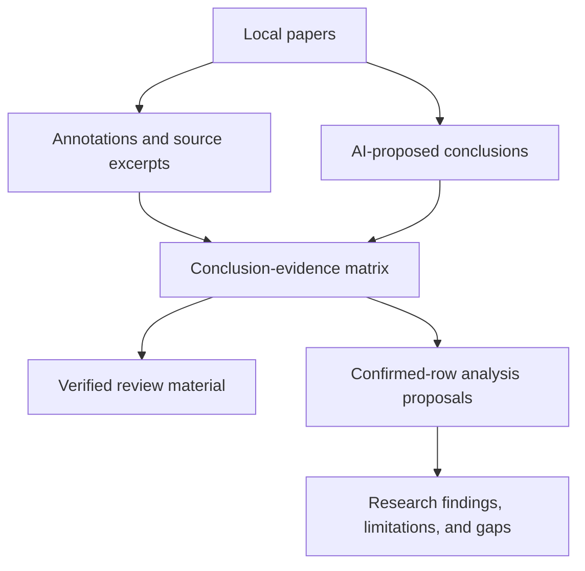
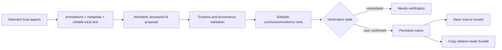
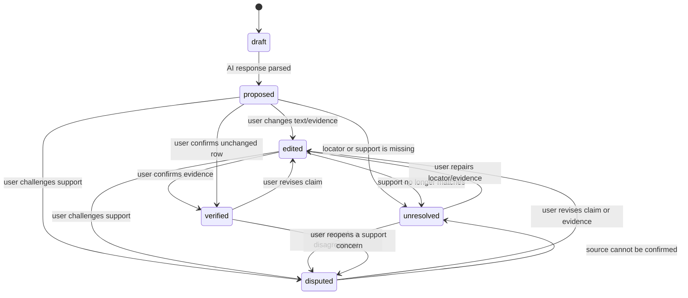

# Cross-Paper Evidence Matrix - Plan

## Goal Capsule

- **Objective:** Turn a researcher's existing annotations into a citable comparison of conclusions and supporting evidence across a small set of locally managed papers.
- **Product authority:** This work extends Xuesen's post-retrieval understanding and evidence layer. It does not become an external search engine or a Word/LaTeX replacement.
- **Open blockers:** None. Locator fallbacks, extraction boundaries, local matching, deletion semantics, and the first citation-copy format are settled in the Planning Contract; exact helper names and renderer tuning remain execution-time details.

---

## Product Contract

### Summary

Xuesen will provide a cross-paper evidence matrix for a user-selected set of local papers, built by extending the existing annotation, metadata, reader-navigation, AI-client, and IndexedDB patterns while keeping comparison evidence in its own domain. Each conclusion will retain source text and a PDF/EPUB locator when available, plus the user's annotation context when available; missing support remains visibly unresolved so verified rows can be reused in a literature review without hiding uncertainty.

### Problem Frame

Researchers may accumulate many useful annotations while reading, but those annotations remain isolated notes rather than reusable literature-review material. When a supervisor or a draft asks what several papers actually concluded and what supports those conclusions, the researcher has to reread PDFs and rebuild the comparison manually.

The current product already stores quoted annotations with file and page context and displays paper and keyword relationships. The missing layer is a trustworthy bridge from those reading artifacts to a structured, citable cross-paper comparison.

### Key Decisions

- KTD1. **Evidence matrix before prose generation:** Start with source-grounded rows rather than a one-click review paragraph (session-settled: user-approved — chosen over direct paragraph generation because later critique depends on a reliable evidence base).
- KTD2. **Conclusion and evidence as the first active work unit:** The matrix remains the first reviewable artifact; a second-stage AI analysis may propose findings, limitations/contradictions, and gaps only from rows the researcher has already confirmed. Unsupported automatic critique remains out of scope (session-settled: user-approved — chosen over leading with gap detection because unsupported gaps would be difficult to verify).
- KTD3. **Post-retrieval understanding layer:** The feature operates on papers the user has already collected and does not compete with CNKI-style retrieval or a writing editor (session-settled: user-approved — chosen over a broader search-and-write product because the project's differentiator is evidence reuse).

### Requirements

**Paper selection and comparison**

- R1. A researcher can select a small, explicit set of locally managed papers for one comparison, with the initial target being three to five papers.
- R2. The comparison presents each paper's primary research conclusion as a distinct, editable row rather than collapsing all papers into one generated summary.
- R3. The user can enter a required `comparisonQuestion` that gives the matrix a clear reason for grouping the selected papers.

**Evidence provenance and trust**

- R4. Every AI-proposed conclusion includes one or more supporting source excerpts and a paper location when the source can be located reliably.
- R5. A conclusion without reliable supporting evidence is visibly marked as needing verification or insufficient evidence and is never presented as a verified fact.
- R6. Existing user annotations, quoted text, and their page or location context can be attached to the corresponding evidence row without overwriting the user's original wording.
- R7. Each conclusion-evidence unit exposes its provenance and verification state so a user can distinguish AI suggestion, user-confirmed evidence, disputed evidence, and unresolved evidence.

**Reuse in research work**

- R8. A user can edit the conclusion, evidence note, and `comparisonQuestion` while preserving the link back to the source paper.
- R9. A verified row can be copied as literature-review material containing the conclusion, source identity, location, excerpt, and optional user annotation.
- R10. A user can return from any evidence row to the source paper and the relevant location when the reader supports that locator; otherwise the row explains that the source locator needs review.

**AI boundaries and local-first behavior**

- R11. AI-generated conclusions, evidence links, and comparison suggestions are presented as proposals until the user verifies them.
- R12. Viewing and editing previously saved evidence remains available from local data when no AI connection is available; new AI extraction reflects the product's configured model and connection state.

**Matrix persistence**

- R13. A user can save a comparison and reopen it later with its selected papers, evidence rows, edits, and verification states intact.

### Actors

- A1. **Researcher:** Selects papers, frames the comparison, verifies evidence, edits conclusions, and reuses verified rows.
- A2. **Xuesen:** Reads the selected local research material, presents the matrix and provenance, preserves user edits, and links rows back to source papers.
- A3. **Configured AI service:** Proposes conclusion and evidence associations from the selected material; it is not the authority for verification.

### Key Flows

- F1. **Build a matrix**
  - **Trigger:** The researcher selects three to five papers and enters a `comparisonQuestion`.
  - **Actors:** A1 researcher, A2 Xuesen, A3 configured AI service.
  - **Steps:** Xuesen proposes conclusion rows; each row displays its source excerpt, location and annotation context when available, plus its verification state; the researcher verifies or edits rows; Xuesen saves the matrix as reusable research material.
  - **Outcome:** The researcher has a comparison whose claims can be checked against the selected papers.
  - **Covers:** R1, R2, R3, R4, R5, R6, R7, R8, R12, R13.
- F2. **Trace a conclusion back to a paper**
  - **Trigger:** The researcher selects a matrix row or evidence excerpt.
  - **Actors:** A1 researcher, A2 Xuesen.
  - **Steps:** Xuesen shows the provenance details and opens the source paper at the stored location when possible; the researcher can correct the row when the location is incomplete or wrong.
  - **Outcome:** A matrix row does not become a detached AI statement.
  - **Covers:** R4, R5, R7, R8, R10, R11.
- F3. **Reuse verified material**
  - **Trigger:** The researcher has one or more verified rows.
  - **Actors:** A1 researcher, A2 Xuesen.
  - **Steps:** The researcher selects rows and copies a citation-ready evidence bundle containing the conclusion, each source identity and location, each excerpt, and annotation context when available.
  - **Outcome:** The researcher can move verified material into a writing tool without rebuilding the comparison.
  - **Covers:** R7, R8, R9.

### Evidence Flow

### Acceptance Examples

- AE1. **Given** three selected papers and source excerpts that can be located, **when** the matrix is generated, **then** every proposed conclusion shows its paper, location, excerpt, and verification state.
- AE2. **Given** a conclusion for which the source cannot be located reliably, **when** the matrix is generated, **then** the row is marked as needing verification or insufficient evidence and cannot appear as user-verified.
- AE3. **Given** a user edits an AI-proposed conclusion or attaches an existing annotation, **when** the row is saved, **then** the user edit and original annotation remain distinguishable from the AI proposal.
- AE4. **Given** a saved verified row, **when** the user chooses to reuse it, **then** the copied material contains the conclusion, source identity, location, excerpt, and optional annotation context.
- AE5. **Given** the AI connection is unavailable, **when** the user opens an existing matrix, **then** saved evidence remains viewable and editable while new extraction is clearly unavailable.
- AE6. **Given** a comparison has been saved, **when** the researcher reopens it later, **then** its selected papers, evidence rows, user edits, and verification states are preserved.

### Success Criteria

- A researcher can start with three to five locally managed papers and produce a usable conclusion-evidence matrix without manually rebuilding a comparison table.
- Every row presented as verified has a visible source path back to a paper location and excerpt.
- A user can reach the source paper from a matrix row and reuse verified rows in a literature review without reopening every paper to reconstruct context.
- The feature makes unsupported or unresolved evidence visible instead of hiding uncertainty behind fluent AI prose.

<!-- ce-section: work-relationships -->
### How This Work Fits Together

This plan owns the first evidence-reuse layer after paper acquisition: turning annotations and source text into a conclusion-evidence matrix. The broader product direction remains a set of related but separately planned layers:

- **Depends on:** The existing reader annotations and paper metadata provide the initial source material.
- **Shares:** The knowledge graph remains the navigation surface for paper relationships and can later open a comparison around a selected cluster.
- **Enables:** The implemented second-stage analysis compares claims only after this matrix supplies traceable, user-confirmed evidence.
- **Enables:** A later review composer can turn verified rows into an outline or cited paragraph for an external writing tool.
- **Can proceed independently of:** Reading-monitor and dashboard improvements, which measure reading behavior rather than evidence quality.

### Scope Boundaries

**Deferred for later**

- Fully automatic contradiction detection or explanation that is not grounded in user-confirmed matrix rows.
- Fully automatic research-gap and opportunity claims that do not retain valid matrix-row references.
- Full literature-review paragraph generation and chapter outlining.
- Team collaboration, shared review workspaces, and external citation-manager integrations.

**Outside this product's identity**

- Replacing CNKI or another external service for broad paper discovery and retrieval.
- Replacing Word, LaTeX, or another writing environment as the place where the final paper is authored.
- Treating a fluent AI summary without source evidence as a trustworthy research result.

### Dependencies and Assumptions

- The comparison operates on papers already imported into Xuesen or otherwise present in its local paper collection.
- Source locators vary between PDF and EPUB; a locator that cannot be verified must remain visibly unresolved rather than being silently normalized.
- The researcher is the final authority for whether a conclusion and its evidence are correct.
- The first release uses existing annotations and extracted paper metadata as primary inputs, with bounded PDF transcript support; OCR and uniform EPUB full-text extraction are out of scope.

### Outstanding Questions

**Deferred to Implementation**

- Parser tolerance for model JSON fences and renderer tuning can follow the settled unresolved/verified contract without changing it.
- Visual density, row grouping, and copy affordance placement can follow the existing token and detail-panel patterns.

### Sources and Research

- `README.md:50-56,77` establishes the current reader, annotation, graph, and post-retrieval product boundary, and identifies citation/page evidence as unfinished.
- `PROGRESS.md:66-70,101-110,123-129` records the current graph evidence gap and the planned expansion from graph relations to annotations, quoted text, page context, and manual confirmation.
- `HANDOFF.md:208-217,241-250` defines the current graph boundary and the intended direction of adding annotation, quote, page, and confirmation evidence.
- `src/types/index.ts:185-204` confirms that annotations already carry file, page, anchor, quoted text, and user-authored body fields.
- `src/types/index.ts:270-285` confirms that graph edges already expose origin and reason, but not source excerpts or page-level evidence.
- `src/types/index.ts:347-359` confirms that paper metadata currently stores abstract and keyword extraction separately from annotations.

---

## Planning Contract

Product Contract preservation: unchanged. The planning decisions below implement the confirmed post-retrieval evidence layer without expanding the product into retrieval, authoring, collaboration, or automatic critique.

### Key Technical Decisions

- KTD4. **Dedicated evidence-matrix domain:** Store comparisons, conclusion rows, evidence items, provenance, and verification state in a new domain parallel to annotations and the graph, rather than adding citation fields to graph edges or mutating original annotations. (session-settled: user-approved — chosen over reusing graph/annotation records because navigation relationships and citable evidence have different lifecycles.) Governs R4, R6, R7, R8, R9, R13.
- KTD5. **Typed locator with explicit unresolved state:** Represent PDF page/anchor, EPUB CFI/location, and unlocatable evidence as distinct locator variants; never coerce EPUB generated locations into the annotation's numeric page field. (session-settled: user-approved — chosen over a shared numeric page because the existing PDF and EPUB renderers use different coordinate systems.) Governs R4, R5, R7, R10, R11.
- KTD6. **Annotation-led local input:** Build proposals from user annotations first, then add reliable local PDF transcript and front-matter metadata; EPUB contributes annotations and metadata where available, while missing extraction remains visible. (session-settled: user-approved — chosen over requiring uniform full-text extraction because EPUB extraction and selection anchors are not yet stable.) Governs R4, R5, R6, R11, R12.
- KTD7. **Existing verification stack:** Keep the repository's current build, lint, browser smoke, and manual acceptance workflow; add no test-runner dependency in this slice. Deterministic parsing and persistence helpers stay isolated so a future runner can cover them without changing the domain contract. (session-settled: user-approved — chosen over introducing a new test framework during this feature.) Governs R5, R7, R10, R12, R13.
- KTD8. **Deterministic local matching and retention:** Match AI excerpts to local material by exact normalized annotation quote first, then exact normalized bounded transcript substring; unmatched excerpts remain `unresolved` and never become verified. Hard deletion removes the entire matrix and its rows when any selected source is permanently deleted; soft deletion preserves the matrix and marks its source as unavailable in the UI. Evidence items remain nested in `EvidenceRow`, persisted in `evidenceRows` with `by-matrix`/`by-updated` indexes. Use a module-level `AbortController` registry keyed by request identity; Zustand stores only serializable request status/identity. (session-settled: user-approved — chosen over fuzzy matching, orphan-preserving hard deletes, normalized evidence tables, and serializing controller instances because those alternatives weaken provenance or violate the store conventions.) Governs R5, R7, R10, R12, R13.

### High-Level Technical Design

The implementation uses a local evidence pipeline. AI output enters as an untrusted proposal, is validated against selected local material, and becomes reusable only after an explicit user verification action.

### Canonical Data Contracts

- The persisted matrix field is `comparisonQuestion`; UI copy may call it a comparison question, but no second topic/label field is introduced.
- A PDF locator is `{ kind: 'pdf-page', page: number, anchor: string | null }`. An EPUB locator is `{ kind: 'epub-cfi', cfi: string | null, location: number | null, sectionIndex: number | null }`. Unsupported or unmatched evidence is `{ kind: 'unresolved', reason: string }`.
- Evidence matching normalizes Unicode whitespace, trims, and compares case-insensitively. Annotation `quotedText` is checked first; a bounded PDF transcript substring is the fallback. No fuzzy similarity is used in the first slice. A match may be user-verified only when the excerpt is non-empty and the locator is not `unresolved`.
- Reader handoff uses `/read/:fileId?matrixId=:matrixId&rowId=:rowId` plus a module-level pending locator payload. `ReaderTopBar` returns to `/evidence-matrix/:matrixId` when the query contains a valid matrix return target; otherwise it keeps the existing `/` behavior.
- A request's `AbortController` lives in a module-level registry keyed by request ID. Zustand stores `requestId` and status only; cancellation resolves through the registry and is cleaned after completion.

The row lifecycle is intentionally explicit:

### Assumptions

- The first entry point is a file-directory multi-selection of three to five active non-folder papers. The knowledge graph also offers a bounded cluster entry that passes selected paper IDs through the same local validation path; graph relations remain selection hints, not evidence.
- A `comparisonQuestion` is required before extraction and is saved with the matrix; empty or whitespace-only questions are rejected locally.
- A matrix can contain zero rows after a failed or cancelled proposal request and remains reopenable with its failure state and selected papers.
- The first citation bundle is plain Markdown text copied to the system clipboard; richer export formats remain deferred.

### System-Wide Impact

- IndexedDB moves from version 7 to version 9 with new typed stores for matrices, rows, and second-stage analyses; existing records remain readable.
- Hard deletion removes the entire matrix and its evidence rows when a selected source is permanently deleted; soft deletion preserves the matrix and evidence while the UI marks that source as unavailable until restored.
- The reader route gains a source-locator handoff. PDF page navigation is reliable; EPUB jumps may be marked unresolved when CFI/location cannot be replayed.
- AI calls use the configured `uiStore.aiSettings`, `isOnline`, and `AbortSignal`. Offline viewing/editing never depends on an AI request.
- Existing graph edge semantics remain unchanged; the graph may later provide paper clusters but does not become the evidence authority in this slice.

### Risks & Dependencies

- **Locator drift:** PDF text-layer anchors and EPUB CFI can become stale after renderer changes or source replacement. Store the original excerpt and verification state, and show a repair path instead of silently jumping elsewhere.
- **Prompt hallucination:** A model may return plausible but unsupported rows. Validate referenced file IDs, excerpts, and locator shapes; rows without matched local support cannot enter the verified state.
- **Large local inputs:** Full PDF transcripts can exceed model limits. Bound each paper to 24,000 characters and the combined request to 72,000 characters, label truncation, and retain annotation-first ordering so a partial request remains interpretable.
- **IndexedDB migration:** A failed upgrade can strand existing local data. Keep new stores additive, use the existing transaction style, and verify both a fresh database and a version-7 upgrade path.
- **Clipboard/privacy:** Citation bundles may contain sensitive notes. Copy only user-selected verified rows, keep the operation local, and avoid sending copied content back to the AI service.

### Phased Delivery

1. **Evidence foundation:** types, locators, IndexedDB persistence, deletion cascade, deterministic input assembly, and strict AI proposal parsing.
2. **Matrix workflow:** local selection, comparison question, row editing and verification, saved/reopened matrices, offline state, and citation copying.
3. **Reader return path:** PDF page jumps, EPUB locator replay where supported, explicit unresolved display, and manual repair flow.
4. **Graph-to-matrix handoff:** From a selected paper or keyword node, open a three-to-five-paper matrix using the strongest existing graph neighborhood; the matrix still requires a comparison question and source verification.

### Deferred to Follow-Up Work

- Add a dedicated Vitest (or equivalent) harness once more local domain utilities justify a shared test runtime.
- Add automatic paragraph generation, citation-manager exports, richer graph evidence, and multi-user collaboration.

---

## Implementation Units

### U1. Evidence domain and local persistence

**Goal:** Define comparison, row, evidence, locator, provenance, and verification records and persist them in IndexedDB without altering existing annotation or graph record shapes.

**Requirements:** R1, R4, R5, R6, R7, R8, R9, R10, R13; AE2, AE3, AE4, AE6.

**Dependencies:** None.

**Files:**

- `src/types/index.ts`
- `src/db/index.ts`
- `src/db/evidenceMatrices.ts`
- `src/db/evidenceRows.ts`
- `src/db/files.ts`
- `scripts/probe-evidence-matrix.mjs`

**Approach:**

1. Add stable IDs and records for a saved comparison, its editable rows, evidence items, source identity, typed locator, proposal provenance, user annotation-body snapshot, and verification state.
2. Add additive version-8 object stores and CRUD/batch helpers following the existing `idb` transaction conventions.
3. Extend hard-delete cleanup so deleting any selected source removes its entire matrix and rows, while soft-deleted files keep their evidence and show an unavailable-source marker.
4. Preserve original annotation records by storing annotation IDs and snapshots/references on evidence items rather than overwriting annotation text.

**Patterns to follow:** `src/db/sessions.ts` CRUD and batch transactions; `src/db/annotations.ts` per-file indexing and document-order sorting; `src/db/files.ts` multi-store deletion transaction; flat types in `src/types/index.ts`.

**Test scenarios:**

- A new matrix with three active file IDs and no rows survives put/list/get round-trip with its comparison question intact.
- A row with a verified PDF evidence item and an attached annotation survives reload without changing the original annotation body or quote.
- A version-7 database upgrades to version 8 with new stores while existing files, annotations, and graph records remain readable.
- Hard deletion of any selected source removes the whole matrix and all of its rows; soft deletion leaves all matrix records intact.
- A batch write followed by a simulated rejected write does not expose a partially committed in-memory collection.

**Verification:** The browser probe can create/read/delete representative records in IndexedDB, and `npm run build` type-checks the schema and cascade changes.

### U2. Local evidence assembly and structured AI proposals

**Goal:** Turn selected local papers and annotations into bounded, validated AI proposals that retain provenance and cannot self-promote to verified evidence.

**Requirements:** R1, R2, R3, R4, R5, R6, R7, R11, R12; AE1, AE2, AE3, AE5.

**Dependencies:** U1.

**Files:**

- `src/utils/evidenceInput.ts`
- `src/utils/evidencePrompt.ts`
- `src/utils/evidenceParse.ts`
- `src/utils/evidenceMatch.ts`
- `src/utils/loadDocumentTranscript.ts`
- `src/utils/aiChat.ts`
- `scripts/probe-evidence-matrix.mjs`

**Approach:**

1. Assemble each selected paper as a bounded input with file identity, abstract/keywords, meaningful annotations, and a labelled PDF transcript when available; cap each paper at 24,000 characters and the combined request at 72,000 characters.
2. Ask the configured model for strict row/provenance JSON; include the comparison question and require an explicit unresolved state when support or location is absent.
3. Parse fenced or plain JSON defensively, reject unknown file IDs and malformed locators, match excerpts using `evidenceMatch.ts`, preserve raw proposal text only for diagnostics, and default every accepted row to proposal/unresolved rather than verified.
4. Accept an `AbortSignal`, offline/key gating, bounded input size, and model errors without destroying an already saved matrix.

**Patterns to follow:** `src/utils/runDigest.ts` for annotation-first orchestration and cancellation; `src/utils/digestPrompt.ts` for labelled local source blocks; `src/utils/graphLinkAi.ts` for strict JSON parsing and validation; `src/utils/aiChat.ts` for non-streaming requests.

**Test scenarios:**

- Three papers with annotations and PDF transcripts produce a prompt whose paper IDs and excerpts remain distinguishable and whose parsed rows start as proposals.
- A model response referencing an unselected file, missing excerpt, invalid locator, or duplicate row is rejected or marked unresolved rather than verified.
- A response wrapped in a Markdown fence parses successfully when its records satisfy the schema; malformed JSON surfaces an actionable extraction error.
- Offline state, empty API key, HTTP failure, and an aborted request leave a saved matrix readable and do not overwrite existing verified rows.
- An EPUB with annotations but no transcript produces a proposal with annotation evidence and a visible extraction limitation.

**Verification:** Parsing and input assembly remain deterministic and inspectable in the browser probe fixtures; manual QA confirms that unsupported model output never shows a verified badge.

### U3. Matrix store and lifecycle orchestration

**Goal:** Coordinate selected papers, saved matrices, proposal requests, row edits, verification, cancellation, and stale-response protection in a flat Zustand store.

**Requirements:** R1, R2, R3, R5, R7, R8, R11, R12, R13; F1, F2, F3; AE2, AE3, AE5, AE6.

**Dependencies:** U1, U2.

**Files:**

- `src/stores/evidenceMatrixStore.ts`
- `scripts/probe-evidence-matrix.mjs`

**Approach:**

1. Keep the active matrix, selected file IDs, rows, load status, extraction status, error message, and request ID flat and serializable; keep the real `AbortController` in the module-level request registry.
2. Load saved records by matrix ID and guard asynchronous proposal results against matrix changes or a newer request.
3. Persist user edits and verification transitions independently from AI proposals; reject verification when evidence is missing or unresolved.
4. Expose local actions for create, reopen, retry, cancel, edit, verify, discard, and copy selection without importing one domain store into another.

**Patterns to follow:** `src/stores/annotationStore.ts` stale-response guard; `src/stores/graphStore.ts` async status/error/member lifecycle; `src/stores/readerStore.ts` imperative nonce-style effects; `useUiStore.getState()` for AI settings.

**Test scenarios:**

- Switching from matrix A to matrix B while A's proposal request is pending does not append A's rows to B.
- Editing a proposed conclusion persists the user text while retaining the original proposal and annotation reference.
- A row with unresolved or empty evidence cannot transition to verified; a row with a matched excerpt can.
- A disputed row is persisted as disputed, cannot be copied as verified, and can return to edited or unresolved after the user resolves the concern.
- Cancelling an in-flight request returns the store to an editable state and preserves prior rows.
- Cancelling or retrying while a persistence write is pending does not let the stale request overwrite the newer matrix or analysis state.
- Reopening a saved matrix while offline restores its selected papers, row edits, and verification states without calling AI.

**Verification:** Store actions produce observable status transitions in the matrix UI, and a reload of the browser tab shows the same persisted rows and verification state.

### U4. Matrix workspace and paper selection entry

**Goal:** Give researchers a focused workspace to select three to five papers, state a comparison question, inspect/edit rows, and save/reopen a matrix.

**Requirements:** R1, R2, R3, R5, R6, R7, R8, R9, R12, R13; F1, F3; AE1, AE3, AE4, AE5, AE6.

**Dependencies:** U3.

**Files:**

- `src/App.tsx`
- `src/features/evidence-matrix/EvidenceMatrixPage.tsx`
- `src/features/evidence-matrix/EvidenceMatrixPage.module.css`
- `src/features/evidence-matrix/EvidenceRowEditor.tsx`
- `src/features/evidence-matrix/EvidenceRowEditor.module.css`
- `src/features/file-directory/FileTable.tsx`
- `src/features/file-directory/FileTable.module.css`
- `scripts/probe-evidence-matrix.mjs`

**Approach:**

1. Add a route for creating and reopening matrices; pass file-directory selections through navigation and keep active-file validation local.
2. Add a comparison action to the existing multi-select header that is enabled only for three to five active non-folder files.
3. Render each conclusion as an editable row with paper identity, excerpt, locator, annotation context, proposal/verification state, and explicit unresolved/disputed copy.
4. Make loading, empty selection, no annotations, offline saved data, AI unavailable, request failure, cancellation, and save failure visible without replacing previously saved content.

**Patterns to follow:** Data Router route metadata in `src/App.tsx`; `GraphInspector` detail-panel composition; common `Button`, `Input`, `Dialog`, `Toast` components; CSS token-only modules; `FileTable` multi-select and `useShallow` patterns.

**Test scenarios:**

- Selecting two files disables comparison; selecting three to five active papers opens a new matrix with those IDs; folders and deleted files are excluded.
- A `comparisonQuestion` containing only whitespace blocks extraction and explains the missing input.
- Generated rows display source identity, evidence, locator type, and non-verified state before any user action.
- User edits to a conclusion, evidence note, and `comparisonQuestion` survive save/reopen while the original annotation quote remains visible.
- Existing saved rows remain readable and editable when the AI key is missing or the browser is offline.
- Copying selected verified rows includes conclusion, every source name/location/excerpt, and the optional annotation-body snapshot; unresolved rows are excluded or clearly marked.

**Verification:** Manual browser acceptance completes the file-directory-to-matrix-to-reopen workflow and the probe confirms the route renders without console/page errors.

### U5. Source locator return path

**Goal:** Return from an evidence row to the source paper at the strongest supported locator and make fallback limitations explicit.

**Requirements:** R4, R5, R7, R8, R10, R11; F2; AE1, AE2.

**Dependencies:** U1, U3, U4.

**Files:**

- `src/stores/readerStore.ts`
- `src/features/reader/ReaderPage.tsx`
- `src/features/reader/canvas/PdfRenderer.tsx`
- `src/features/reader/canvas/EpubRenderer.tsx`
- `src/features/reader/ReaderTopBar.tsx`
- `scripts/probe-evidence-matrix.mjs`

**Approach:**

1. Add an explicit pending locator handoff independent of `focusAnnotationId`, preserving the current route shape and page clamping behavior.
2. Navigate PDFs to the stored page and use the excerpt/anchor only as a verification hint when a precise text-layer jump is unavailable.
3. Replay EPUB CFI/location only when the renderer can validate it; otherwise open the paper and mark the row as needing locator review.
4. Preserve the selected excerpt and annotation context when the source cannot be opened, and provide a return path to `/evidence-matrix/:matrixId` through the validated query target.

**Patterns to follow:** `readerStore` page state and nonce effects; PDF `[data-page]` query/scroll behavior in `PdfRenderer`; EPUB `book.locations`/CFI mapping in `EpubRenderer`; `ReaderPage` route validation and cleanup.

**Test scenarios:**

- A verified PDF row opens `/read/:fileId` at the stored page and keeps the matrix return target available.
- A PDF row with no precise anchor opens at its page and labels the excerpt as needing visual confirmation rather than claiming a character-level jump.
- An EPUB row with a replayable CFI/location opens at that position; an invalid or absent locator opens the paper without falsely claiming success.
- A soft-deleted source or missing blob does not crash the reader; the matrix row reports that the source is unavailable. A permanently deleted source removes its matrix before this path is reached.
- Selection-created annotations continue to preserve quoted text and page while the new locator handoff remains optional.

**Verification:** Manual acceptance checks both PDF and EPUB paths, including a deliberately unresolved locator, and the browser probe confirms no route-level errors.

### U6. Citation-ready reuse and integration hardening

**Goal:** Make verified rows reusable outside Xuesen and close cross-cutting cleanup, offline, accessibility, and regression gaps.

**Requirements:** R7, R8, R9, R10, R12, R13; F2, F3; AE4, AE5, AE6.

**Dependencies:** U1, U3, U4, U5.

**Files:**

- `src/utils/evidenceCitation.ts`
- `src/features/evidence-matrix/EvidenceMatrixPage.tsx`
- `src/features/evidence-matrix/EvidenceRowEditor.tsx`
- `src/features/evidence-matrix/EvidenceRowEditor.module.css`
- `src/features/evidence-matrix/EvidenceMatrixPage.module.css`
- `scripts/probe-evidence-matrix.mjs`

**Approach:**

1. Format selected verified rows as stable Markdown/plain text with the conclusion, source identity, locator, excerpt, and optional annotation context.
2. Make copy failures, empty verified selection, and clipboard permission denial recoverable through the existing toast pattern.
3. Add a restrained graph-to-matrix navigation affordance without changing graph edge semantics; the matrix remains the evidence authority.
4. Audit labels, keyboard focus, reduced motion, token-only styling, stale request cleanup, and removal of abandoned experiments before final verification.

**Patterns to follow:** `downloadDigestMarkdown` for safe local text formatting; common toast/clipboard usage in `SelectionToolbar`; `GraphInspector` source/reason presentation; existing CSS token and accessibility conventions.

**Test scenarios:**

- Copying one or more verified rows produces deterministic Markdown with the conclusion, source identity, locator, excerpt, and optional annotation context; no AI-only or unresolved row content is presented as verified.
- Copying with no eligible rows shows a recoverable message and does not clear the matrix.
- Clipboard rejection leaves the row selection and verification state unchanged.
- Existing graph navigation still opens papers and graph edges still render with their original origin/reason semantics.
- A full refresh, offline reopen, and route back from the reader preserve the matrix without duplicate rows or leaked request state.

**Verification:** `npm run lint`, `npm run build`, the evidence browser probe, and manual keyboard/offline/copy checks pass with no new console errors.

---

## Verification Contract

| Gate | Applies to | Done signal |
| --- | --- | --- |
| `npm run build` | U1–U6 | TypeScript and Vite production build complete without errors. |
| `npm run lint` | U1–U6 | Oxlint reports no new violations. |
| `node scripts/probe-evidence-matrix.mjs` | U1–U6 | The app renders the matrix route, reports no page/console errors, and exercises the local persistence smoke path when fixtures are available. |
| Manual matrix workflow | U3–U6 | Three papers can be selected, proposed rows reviewed, one row verified, source revisited, copied, saved, reopened, and edited offline. |
| Locator failure workflow | U2, U5 | Missing, stale, and EPUB-unsupported locators remain visibly unresolved and never become verified. |
| Existing graph regression check | U6 | Knowledge graph loads, selects a paper, opens the reader, and retains current edge origin/reason display. |

The repository has no formal test runner today; this plan therefore uses the existing browser probe plus deterministic helper boundaries and manual acceptance rather than adding a new dependency. Any future test-runner adoption must preserve the same scenarios and evidence-state contract.

---

## Definition of Done

- All in-scope requirements and acceptance examples are traceable to implemented UI, persistence, source navigation, or verification behavior.
- A saved matrix retains selected papers, comparison question, row edits, evidence provenance, and verification state across reload and offline mode.
- No unverified AI proposal, unsupported locator, or unlocatable excerpt can be shown as user-verified.
- Verified rows copy as citation-ready material with the conclusion, source identity, location, excerpt, and optional annotation context.
- PDF source return is page-correct; EPUB return either replays a validated locator or visibly reports unresolved status.
- Existing annotations remain intact, and hard deletion leaves no matrix/evidence orphans.
- The knowledge graph and reader continue to pass their existing smoke workflows.
- `npm run build`, `npm run lint`, the evidence probe, and the listed manual scenarios pass.
- Abandoned experiments, dead branches, temporary fixtures, and unused exports are removed before completion; only the chosen evidence-matrix path remains in the diff.
