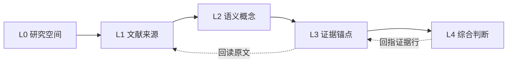

# Phase 003 - Knowledge Graph UI and Hierarchy Contract

> **Presentation authority note:** Phase 006 supersedes this document's global view
> switcher and canvas composition. The L0-L4 data hierarchy, evidence boundary,
> relation vocabulary and compatibility mapping remain valid unless Phase 006
> explicitly narrows them.

## 1. Decision summary

The knowledge graph is a research navigation surface, not a second evidence
database and not a decorative network. Its hierarchy is split into two
contracts:

1. **Data hierarchy** explains what a relationship means and where its support
   lives.
2. **Visual hierarchy** decides what is allowed onto a canvas at one time so
   the user can inspect, compare, and return to the source without losing
   context.

The core rule is:

> A graph relation may suggest where to look; only a located excerpt or user
> annotation that is verified in the evidence matrix may be reused as a
> citation-ready research claim.

This preserves the existing boundary that graph edges are read-only and keeps
the evidence matrix as the authority for `研究结论与证据`, `局限与矛盾`, and
`研究空白与机会`.

## 2. Data hierarchy

| Level | Name | Canonical content | Canvas policy | Source of truth |
|---|---|---|---|---|
| L0 | 研究空间 | 当前工作区、文件夹范围、筛选条件、统计 | Never a force node; shown as breadcrumb and scope header | `files` + UI selection |
| L1 | 文献来源 | 文件夹、论文、文件状态、阅读入口 | Yes; overview and paper views | `files`, `graphNodes`, `graphMembers` |
| L2 | 语义概念 | 主题、方法、数据集、变量、结果指标、关键词别名 | Yes; concepts may be clustered and expanded | `keywordNodes`, `keywordEdges`, future concept metadata |
| L3 | 证据锚点 | 批注、原文摘录、页码/CFI、匹配方式、定位状态 | No global force graph; local expansion for the selected node | `annotations`, `EvidenceItem` |
| L4 | 综合判断 | 跨论文结论、局限/矛盾、研究空白/机会及其行引用 | No force graph; rendered as evidence-matrix analysis | `EvidenceRow`, `EvidenceAnalysisItem` |



The dotted links are deliberate: evidence and synthesis are navigational
references, not extra force-directed edges that should be interpreted as
semantic similarity.

### 2.1 Compatibility mapping for the current model

The current records remain valid during the first implementation slice:

| Current record | Target meaning | Required interpretation |
|---|---|---|
| `GraphNode(kind: 'folder')` | L1 collection | Structural containment, not a semantic claim |
| `GraphNode(kind: 'file')` | L1 paper/source | A navigable local source; it does not imply the paper is relevant to the current question |
| `KeywordNode` / `GraphNode(kind: 'tag')` | L2 concept | A candidate concept produced from document metadata, local co-occurrence, or AI |
| `GraphEdge` / `KeywordEdge` | L1-L1, L1-L2, or L2-L2 relation | A navigational lead with an origin and reason, never a verified citation |
| `Annotation` / `EvidenceItem` | L3 evidence anchor | The only layer that can carry a source locator and excerpt |
| `EvidenceRow` / `EvidenceAnalysisItem` | L4 synthesis | The only layer that may become citation-ready after user verification |

No L3 or L4 item should be duplicated as an ordinary force-graph node in this
phase. That would create a large, noisy graph and would make a visual proximity
look like evidence strength.

### 2.2 Relationship vocabulary

The first implementation may continue to store the existing undifferentiated
edge records, but the UI must present their intended meaning explicitly.

| Relationship | Direction | Display label | Minimum support |
|---|---|---|---|
| `contains` | collection -> paper | 所属文件夹 | file tree only |
| `mentions` | paper -> concept | 提及 / 关键词 | extracted metadata or local text |
| `relates` | paper <-> paper or concept <-> concept | 相关线索 | co-occurrence or AI proposal |
| `supports` | evidence -> synthesis row | 支持 | located excerpt + row link |
| `contradicts` | evidence -> synthesis row | 存在矛盾 | two or more located, disagreeing sources |
| `extends` | paper/evidence -> synthesis row | 延伸 | located source and explicit comparison context |

Only `contains`, `mentions`, and `relates` are candidates for the global graph
in the first slice. `supports`, `contradicts`, and `extends` are rendered in
the evidence matrix and in the selected-node inspector until their evidence
model is mature enough for a local evidence view.

### 2.3 Provenance and verification language

Every visible relationship must expose two separate concepts:

- **来源**: `AI 语义`, `关键词共现`, `用户确认`, or `来源未记录`.
- **证据状态**: `线索`, `待核对`, `已确认`, `争议`, `证据不足`, or `来源失效`.

The graph may show `线索` even when it has no locator. It must not label that
relation as `结论`, `事实`, or `已验证`. A relation becomes `已确认` only when
the linked evidence row satisfies the existing local matching rules and the
user confirms it. If its source file is deleted or its locator can no longer be
resolved, the relation is demoted to `来源失效`/`待核对` and cannot be copied.

## 3. Visual hierarchy and view model

The route keeps one graph work surface with explicit views rather than two
equal canvases that compete for attention.

### 3.1 View switcher

The top-level segmented view switcher has four options:

| View | Default question | Visible layers |
|---|---|---|
| `概览` | 我的研究空间里有什么？ | L0 + L1, collections collapsed by default |
| `论文` | 哪些论文彼此相关？ | L1 paper nodes + `relates` edges |
| `主题` | 这些论文围绕哪些概念？ | L1 paper nodes + L2 concept nodes |
| `证据` | 这条关系能回到哪段原文？ | Selected L1/L2 node and at most 20 L3 anchors |

`综合判断` remains a deep link to `/evidence-matrix`. The graph can offer a
`打开证据矩阵` action, but does not reproduce the matrix editor as a graph
overlay.

### 3.2 Desktop composition (>= 1200px)

```text
PageHeader:  知识图谱 / 主题     [view switcher] [search] [filter] [refresh]
┌──────────────┬────────────────────────────────────────┬──────────────────┐
│ scope rail   │ current view canvas                    │ inspector        │
│              │                                        │                  │
│ space        │ nodes + edges + legend                 │ selected node    │
│ collections  │ status strip / empty state             │ provenance       │
│ view filters │                                        │ evidence links   │
└──────────────┴────────────────────────────────────────┴──────────────────┘
```

- The scope rail is structural navigation, not another card grid. It shows the
  current folder scope, counts, and the four views.
- The canvas receives the remaining height and width. It never scrolls
  horizontally to reveal the inspector.
- The inspector is a bounded reading surface. It shows the reason for a
  relation before offering `打开阅读`, `回读来源`, or `加入证据矩阵`.

Recommended desktop tracks are `208px minmax(0, 1fr) 320px`; use existing
layout tokens for the actual implementation and allow the inspector to collapse
when the content area becomes narrow.

### 3.3 Tablet and mobile composition (< 1200px)

- At 900-1199px, the scope rail becomes a compact top selector. The inspector
  can overlay the canvas from the right and must have a labelled close action.
- Below 900px, the canvas is first in document order. The inspector becomes a
  bottom sheet or full-height sheet, depending on content, and never squeezes
  the graph into an unusable strip.
- The view switcher is horizontally scrollable only as a control row; the
  canvas itself must not create page-level horizontal overflow.
- At 390px, the selected-node sheet starts with the title, node type, and one
  primary action. Relationship lists and evidence anchors scroll inside the
  sheet; the page remains anchored to the canvas.
- Touch targets remain at least 44px. Node labels may be abbreviated visually,
  but the accessible name always contains the full title.

### 3.4 Node and edge treatment

- Paper/source nodes use the existing file semantics; concepts use the existing
  tag semantics until a role field is introduced.
- Collection nodes are visually quieter and are collapsed in `概览` unless the
  user expands them. They must not dominate paper nodes.
- Selected nodes use an accent ring, label, and inspector state. Color alone is
  never the selection signal.
- Edges encode relation origin with the existing legend. Weight is a lead
  strength, not a probability or evidence score; do not print a percentage
  unless the inspector explains its calculation.
- Unsupported or stale relations use a neutral/dashed treatment and a text
  status. Do not hide them silently after a source changes.
- Labels are collision-aware and can be hidden at low zoom. The full label is
  available through the node tooltip/accessible name and inspector.

## 4. Interaction contract

### 4.1 Navigation and selection

1. Changing view updates the breadcrumb and preserves the current scope.
2. Search filters the active view only; it does not silently change the scope.
3. Selecting a paper highlights its concepts and related papers. Selecting a
   concept highlights its papers and neighboring concepts.
4. `Escape` closes the inspector/sheet first, then clears selection. A second
   `Escape` returns focus to the view switcher.
5. The inspector offers `打开阅读` only for a resolvable local file. It offers
   `回读来源` only when a locator is present and can be mapped to PDF page or
   EPUB CFI.
6. `加入证据矩阵` passes three to five related file IDs and always opens the
   matrix setup state. It never treats graph edges as already verified.

### 4.2 Scope and filtering

The filter surface has four independent groups:

- 文件夹/研究范围;
- 节点层级 (`论文`, `主题`, `证据`);
- 关系来源 (`AI`, `共现`, `用户确认`, `来源未记录`);
- 证据状态 (`线索`, `待核对`, `已确认`, `争议`, `来源失效`).

Filters are URL-addressable only when the existing route contract supports it;
otherwise they are local UI state. Clearing a filter must not clear the active
node or delete graph data.

### 4.3 Direct manipulation

Node dragging remains a direct-manipulation interaction: pointer capture,
1:1 tracking, and persistence on release. A layout refresh starts from the
current presentation state and may be interrupted. Do not add scripted bounce
or auto-rotation. With reduced motion, preserve immediate selection and color
feedback but remove graph settling animation.

## 5. Inspector contract

The inspector is the bridge between graph navigation and citation-ready work.
Its order is fixed:

1. Identity: title, type, scope, and count of connected items.
2. Relationship explanation: relation label, origin, reason, and evidence
   status. `来源未记录` is explicit for legacy records.
3. Source preview: abstract/metadata when available; never presented as a
   quoted source excerpt.
4. Evidence anchors: quoted text, annotation context, page/CFI, match method,
   and verification status. Missing locators use `待核对`.
5. Actions: `打开阅读`, `回读来源`, `加入证据矩阵`, and a secondary `查看关联`
   action. No manual edge creation/deletion.

For a concept, the inspector also shows aliases and the papers that contributed
the concept. For a paper, it shows the most relevant concepts and a bounded
list of related papers. Lists are capped in the inspector with `查看全部` so
the sheet remains readable.

## 6. State and failure contract

| State | Required behavior |
|---|---|
| Loading | Keep the last stable graph when possible; show a neutral canvas status strip |
| Analyzing | Show `正在整理论文关系…` or `正在整理主题…`; search and navigation remain enabled |
| Empty scope | Show `此研究范围还没有图谱节点` plus `返回文件目录` / `刷新` |
| No match | Keep the current view and show `无匹配节点`; offer `清除筛选` |
| Offline | Existing graph remains readable; new AI analysis is disabled with `离线状态下暂不可用` |
| Missing source | Keep the relation visible as `来源失效`; disable copy and source jump |
| Error | Inline `图谱加载失败。请重试。`; do not replace the entire shell |
| Stale selection | Clear the inspector safely when a filtered/deleted node disappears |

Status text is paired with icon/text, not color alone, and uses `role="status"`
for progress and `role="alert"` for errors.

## 7. Accessibility and copy

- The canvas has an accessible summary of the current view and node count. Each
  node has an accessible name containing its full title, type, and relation
  status.
- The inspector is a labelled region. Mobile sheets use the existing focus trap,
  Escape handling, focus return, and `aria-expanded`/`aria-hidden` contract from
  Phase 002.
- Keyboard users can reach the view switcher, search, filters, selected-node
  actions, and relation list without needing a pointer.
- Use direct labels: `查看证据`, `回读来源`, `打开阅读`, `加入证据矩阵`, `清除筛选`.
  Avoid generic `确定`/`更多` when the action can be named.
- AI suggestions are labelled `AI 提议` or `线索`; never use `已验证` before the
  evidence matrix confirmation path.

## 8. Performance and graph-size guardrails

- `概览` defaults to collapsed collections and at most the first visible paper
  cluster. `论文` and `主题` target no more than 80 rendered nodes and 160
  rendered edges at once.
- When a scope exceeds the target, group by folder/concept and offer `展开此
  群组`; do not render every L3/L4 item globally.
- `证据` renders only the selected node's local anchors (target 20) and uses a
  list for overflow rather than a larger force graph.
- Refresh keeps the current selection when its record remains valid and avoids
  a blank flash between old and new graph data.

## 9. Definition of done for the design phase

- The current dual-canvas implementation can be mapped to `论文` and `主题`
  views without losing existing search, filtering, highlighting, drag, or
  reader/matrix actions.
- Every path from a relation to a reusable research statement passes through a
  located evidence anchor and user verification in the existing evidence
  matrix.
- L3 and L4 are explicitly represented in the inspector/matrix contract, not
  silently omitted from the product model.
- Desktop, tablet, and 390px mobile layouts have a single primary reading
  surface, no page-level horizontal overflow, and no panel that hides the
  source action.
- Legacy edges without `origin` or `reason` remain readable and are labelled
  `来源未记录` rather than being upgraded to AI claims.

## 10. Open decisions intentionally deferred

- Whether L2 concepts should be split into `topic`, `method`, `dataset`, and
  `outcome` as a persisted union, or remain a canonical keyword with optional
  role metadata.
- Whether a future citation graph should import external bibliographic edges;
  this is outside the current local-first scope and must not be inferred from
  title similarity.
- Whether graph relation confirmation should be a separate action or remain
  exclusively a consequence of evidence-row verification. The first slice
  should keep the latter to avoid two competing truth systems.
