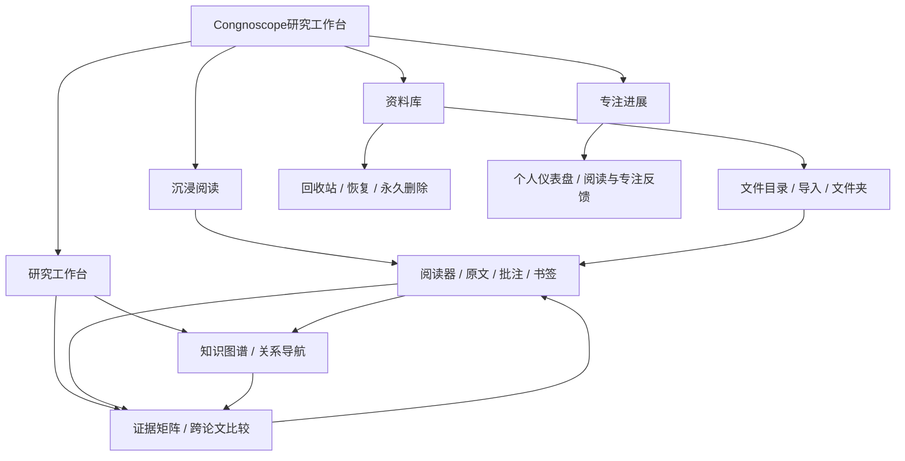

# Phase 004 - Congnoscope系统级 UI 设计契约

## 1. Design intent

Congnoscope是一个本地优先的学术研究工作台，不是论文搜索首页，也不是把多个
AI 工具拼在一起的控制台。UI 的第一责任是让用户始终知道：

1. 我现在处于研究流程的哪一步；
2. 当前内容来自哪里，是否已经核对；
3. 下一步可以做什么，以及如何回到原文；
4. 一个动作正在进行、完成、失败或被离线能力限制的原因。

全局情绪是**安静、精确、可回读**。视觉上降低装饰和卡片堆叠，把注意力
留给文件、原文、证据和研究判断。Apple Design 的直接操控、空间一致性、
可中断动效、减弱动效和透明度适配作为本阶段的交互基础。

### 1.1 Product boundary

- 保留现有路由、Zustand 状态、IndexedDB、PDF/EPUB 阅读和本地摄像头边界。
- 视觉重新设计不等于改变 AI、证据矩阵或图谱的可信度规则。
- 图谱关系仍是导航线索；只有证据矩阵中带可靠定位并经用户确认的内容
  才能成为可复制的研究材料。
- 不新增组件库，不引入新的动画依赖；先用 CSS transform/opacity、Pointer
  Events 和现有 token 实现，确有必要时才封装小型 motion utility。

## 2. Page hierarchy

### 2.1 Product information architecture



The route URLs remain backward-compatible:

| Product group | Route | User job | Navigation priority |
|---|---|---|---|
| 资料库 | `/` | 导入、整理、找到论文 | Primary entry |
| 资料库 | `/trash` | 恢复或永久清理文件 | Utility, visually quieter |
| 研究工作台 | `/knowledge-graph` | 发现主题和论文关系 | Secondary research entry |
| 研究工作台 | `/evidence-matrix` | 跨论文核对、整理、复制证据 | Primary research output |
| 专注进展 | `/dashboard` | 回顾阅读和专注行为 | Feedback, not a task blocker |
| 沉浸阅读 | `/read/:fileId` | 阅读原文、批注、回读定位 | Fullscreen context mode |

### 2.2 Hierarchy levels

| Level | UI responsibility | Examples |
|---|---|---|
| P0 shell | Global wayfinding and persistent status | brand, nav groups, offline state, settings |
| P1 page | A complete user job | 文件目录、知识图谱、证据矩阵、仪表盘 |
| P2 work surface | The primary surface of a page | file table, graph canvas, evidence rows, heatmap |
| P3 inspector | Context and next action for the selected item | file actions, graph inspector, evidence source panel |
| P4 transient layer | Short-lived focus or confirmation | menu, tooltip, toast, dialog, sheet |

No P4 layer may obscure a P2 surface without a clear close/cancel path. P3 is
parallel context on desktop and a sheet on compact layouts; it is not a second
page disguised as a card.

### 2.3 Navigation grouping

Desktop Sidebar groups are visible and ordered by the common path:

1. `资料库`: 文件目录, 回收站;
2. `研究`: 知识图谱, 证据矩阵;
3. `进展`: 个人仪表盘.

The mobile drawer preserves this grouping. The active route gets an icon, label,
accent marker, and a short context description where space permits. The reader
does not appear as a permanent Sidebar item because it is entered from a source
and its back action must return to that source context.

### 2.4 Research workflow and return paths

The interface makes this sequence legible without forcing it:

```text
导入文件 -> 阅读/批注 -> 关系导航 -> 选择论文簇
     ^          |             |              |
     |          v             v              v
  文件目录 <- 回读来源 <- 证据矩阵 <- 研究分析/复制材料
```

- Every source jump records enough route state to return to the matrix or graph.
- Every matrix row exposes a source identity and a `回读来源` action.
- Every page has an obvious exit: Sidebar route, breadcrumb link, or reader back.
- The dashboard never becomes a required gate between research actions.

## 3. Visual language

### 3.1 Tone and composition

- Use dense but breathable layouts suitable for repeated research work.
- Use full-width sections and unframed work surfaces. Use cards only for a
  repeated item, a metric group, a saved matrix, or a genuinely framed tool.
- Never put a card inside another card. Avoid gradients, decorative orbs,
  bokeh, oversized hero text, and marketing-style empty space.
- Use one restrained accent at a time. Accent means current focus, selection,
  progress, or a meaningful action, not a universal border color.
- Keep text tracking at `0`; use weight, leading, and grouping for hierarchy.
- Use `font-variant-numeric: tabular-nums` for metrics, pages, counts, and scores.

### 3.2 Surface stack

| Surface | Token role | Where it appears | Depth rule |
|---|---|---|---|
| Canvas | `--bg-base` | page background, reader canvas | No shadow |
| Section | `--bg-surface` or transparent | page sections, table regions | Divider only when grouping needs it |
| Raised | `--bg-elevated` | sidebar, selected row group, metric group | `--shadow-sm` only for repeated items |
| Floating | `--bg-surface` | menu, inspector sheet, selection toolbar | `--shadow-md` and source-aware origin |
| Modal | `--bg-surface` + overlay | dialog, destructive confirmation | `--shadow-lg`, scrim, focus trap |

Materials should be opaque by default. Translucency/backdrop blur is allowed only
for a floating toolbar or sheet where text contrast remains compliant. Never stack
two translucent surfaces over readable text.

### 3.3 Type scale

The existing token scale remains the source of truth. Roles are assigned as
follows:

| Role | Token | Use |
|---|---|---|
| Page title | `--text-h1` | current page identity in PageHeader |
| Section title | `--text-h2` | one work-surface heading |
| Item title | `--text-h3` | file, paper, matrix, source identity |
| Body | `--text-body` | evidence prose, metadata values, controls |
| Supporting | `--text-sm` | table headers, secondary descriptions |
| Locator | `--text-xs` | page/CFI, timestamps, provenance, statuses |
| Reader body | `--text-reader` | document content only |

Page titles must answer “where am I”; section titles must answer “what can I do
here”. Avoid using display-scale typography outside the dashboard metric value.

### 3.4 Interaction geometry

- Pointer layout: 32/36/40px button heights as already defined.
- Touch layout: 44px minimum hit area, even when the icon remains 16/20/24px.
- Focus rings use `--focus-ring-width` and `--focus-ring-offset` and never rely
  only on color or shadow.
- Destructive actions use `--danger` only for the action and its consequence;
  warning states use `--warning`, not danger red.
- The longest file title, matrix question, and source excerpt must wrap inside
  its parent rather than overlap a neighboring control.

## 4. Shared shell redesign

### 4.1 AppShell

Desktop has three persistent bands: navigation, page header, and scrollable
content. The content region owns vertical scrolling; the page itself never
creates a second body scrollbar.

- Sidebar: 240px expanded / 64px collapsed on pointer layouts.
- PageHeader: stable 56px, with breadcrumb/title left and task actions right.
- OfflineBanner: materializes above the header only when offline; it does not
  permanently reserve empty space online.
- Settings: global sheet with a visible title, group navigation, save/cancel
  actions, and focus return to the gear trigger.
- Route changes close mobile navigation and transient layers, but do not reset
  persistent domain state.

### 4.2 PageHeader contract

The header has one primary identity and no competing hero copy. Actions are
ordered by frequency: primary action, source/navigation action, overflow. On
compact widths, actions wrap into a dedicated row; the title remains readable and
the action row remains keyboard reachable.

### 4.3 Sidebar contract

The sidebar communicates the product hierarchy, not a collection of unrelated
links. Section labels are hidden only in the 64px collapsed state; tooltips and
accessible names retain the full labels. The selected route has an accent marker,
subtle active surface, and a stable icon position so collapse does not cause
layout drift.

## 5. Route design contracts

### 5.1 文件目录: source management first

Order within the page:

1. PageHeader identity and `导入文件` primary action;
2. Scope row: current folder, search, type/sort filters;
3. Import dropzone only when importing or when the library is empty;
4. File table/list as the dominant work surface;
5. Batch action bar appears adjacent to the selected rows, not as a competing
   page header;
6. Rename/move/delete actions remain attached to the file row.

The table is the default desktop density. At compact widths it becomes a list
with filename, updated time, and an always-visible overflow action. Empty and
error states include a concrete next action. Selection, import, move, and soft
delete provide immediate press feedback and completion toasts.

### 5.2 个人仪表盘: feedback, not decoration

The dashboard is a reading-health report with three bands:

1. **Today / selected range**: a compact metric strip for focus duration and
   reading lines, with delta and data freshness.
2. **Reading rhythm**: one full-width heatmap section with streak, legend, and
   empty-state explanation.
3. **Session evidence**: a filterable session table with monitor availability,
   focus score, distraction summary, and a source-reader jump when available.

Metric values may use a short number-ticker only when a range changes; do not
animate numbers continuously or turn the dashboard into a game. A monitor-offline
state is explicit but never blocks the local reading history.

### 5.3 知识图谱: navigation and evidence bridge

Use the Phase 003 hierarchy and views:

- `概览`: research scope and collections;
- `论文`: source-to-source relations;
- `主题`: papers and concepts;
- `证据`: selected node's local evidence anchors.

The work surface is `scope rail + canvas + inspector` on desktop, and `canvas +
sheet` on compact layouts. The inspector order is identity, relationship reason,
provenance, evidence anchors, and actions. No visual relation may be labelled a
verified conclusion without the evidence-matrix path.

### 5.4 证据矩阵: verification workspace

The page has a clear three-step hierarchy:

1. **Setup**: selected papers, `comparisonQuestion`, generation/cancel state;
2. **Matrix**: conclusion rows with source identity, quote, locator, provenance,
   and verification state;
3. **Analysis**: findings, limitations/contradictions, and gaps/opportunities
   that reference confirmed matrix rows.

The matrix is not a gallery of cards. Each row is a stable editing unit with a
visible status rail and source actions. The analysis panel is secondary and stays
visually quiet until confirmed rows exist. `复制引用` is disabled for unresolved,
disputed, or unverified material.

### 5.5 回收站: reversible utility

The page is intentionally quiet: a short retention banner, search/empty action,
and the same file list language as the library. Restore is the primary action;
permanent delete and empty trash are visually separated and require explicit
confirmation. No animation should make destructive actions feel playful.

### 5.6 阅读器: immersive source mode

The reader removes the global Sidebar and keeps a focused chrome:

```text
TopBar: back/source identity | document mode | search/reader controls
Body:   TOC sheet/panel | document canvas | annotation/QA/source panel
Bottom: page/progress | read lines | zoom | local monitor state
```

- The document canvas receives the largest available area.
- TOC and SidePanel are parallel panels on wide screens and edge sheets on
  compact screens. They never force the reader below its usable width.
- Source-return context from evidence matrix is visible in the top bar and the
  selected locator is shown in the side panel before the user jumps.
- Camera/monitor status is a text + dot status, never a silent pulsing ornament.
- Fullscreen is a context mode, not a separate page; exiting returns the same
  document position and settings.

### 5.7 Settings, dialogs, menus, and toasts

- Settings is a persistent-form sheet with grouped settings, not a dense modal.
- Dialogs are reserved for irreversible or high-cost actions.
- Menus open from their trigger with an origin-aware scale/fade and close by
  Escape, outside click, or completing the action.
- Toasts confirm completion or warn about an unavailable action; they never carry
  the only copy of a source locator or error reason.

## 6. Animation language

### 6.1 Motion principles

1. **Response**: pointer-down shows feedback immediately; commit happens on
   pointer-up/click.
2. **Purposeful animation**: motion answers where content came from, what changed,
   or whether an action completed.
3. **Spatial consistency**: enter and exit follow the same edge; menus grow from
   their trigger; source jumps preserve identity.
4. **Interruptibility**: drawers, sheets, panel resizers, and graph nodes can be
   redirected mid-motion from their live presentation value.
5. **Restraint**: one primary motion per interaction; no ambient motion on idle
   content except the live monitor status.
6. **Reduced motion**: remove travel, bounce, ticker, shimmer, and graph settling;
   retain immediate color/opacity feedback and focus movement.

### 6.2 Motion vocabulary and token mapping

| Name | Use | Default behavior |
|---|---|---|
| Press / Tap feedback | buttons, rows, icon buttons | immediate background + subtle `scale(0.98)`, `--dur-fast` |
| Crossfade | route content/state replacement | opacity plus at most 4px translate, `--dur-base` |
| Direction-aware transition | page/section changes with a clear direction | move from the source edge; never randomize direction |
| Origin-aware animation | menu, tooltip, popover, inspector | transform origin at trigger, scale/opacity, `--dur-fast` |
| Slide in / out | drawer and sheet | transform only, `--dur-slow`, symmetric exit path |
| Accordion / Collapse | details, analysis sections, TOC groups | height/clip is allowed for non-gesture disclosure; keep focus stable |
| Layout animation | row selection, toolbar wrapping, metric range change | animate transform/opacity; avoid per-frame layout thrash |
| Spring / Momentum | released drag, sheet flick, graph node release | critically damped by default; bounce only after a real flick |
| Rubber-banding | sheet/scroll boundary | progressive resistance, then spring back |
| Pulse | live monitor status only | low-amplitude, stops in reduced-motion mode |
| Skeleton / Shimmer | slow data loading | one restrained shimmer; no shimmer for instant local reads |

### 6.3 Interaction timing table

| Interaction | Visual response | Implementation rule |
|---|---|---|
| Button press | active surface immediately | `:active`/pointer state, do not wait for click |
| Route change | current page fades into next | keep old content until next route is ready when possible |
| Mobile nav | left sheet follows the trigger edge | focus trap, Escape, outside click, focus return |
| Settings | left sheet follows the settings trigger | preserve the current tab during a temporary close |
| Graph inspector | right sheet on desktop/compact overlay | no scrim for non-blocking desktop inspector; scrim on mobile |
| Evidence source jump | matrix row remains identifiable, reader opens at locator | no generic spinner-only navigation |
| Reader TOC/side panel | edge sheet or width change | direct drag; disable transitions while resizing |
| Graph node drag | node tracks pointer 1:1 | Pointer Events + capture; persist on release |
| Toast | short origin-aware slide/fade | dismissible; no bounce or infinite loop |
| Camera status | text plus small pulse when live | no pulse when paused, offline, or reduced motion |

### 6.4 Motion budget and performance

- Animate only `transform` and `opacity` on gesture-driven surfaces. Use width
  transitions only for non-dragging desktop panel state changes.
- Never animate `top`, `left`, `width`, `height`, or box-shadow every frame during
  a drag. Use a compositor-friendly transform and commit dimensions after release.
- Avoid full-viewport parallax, orbiting decoration, auto-rotating graphs,
  looping background gradients, and long typewriter text.
- Use `will-change` only during imminent drag/transition and remove it after settle.
- Keep repeated interactions shorter and quieter than rare confirmations. A file
  row hover should be near-instant; a destructive confirmation may use a slower
  scrim to communicate focus.

### 6.5 Reduced-motion, transparency, and contrast

The global stylesheet must respond independently to:

- `prefers-reduced-motion: reduce`: crossfade/static feedback; no slide, bounce,
  ticker, shimmer, camera breathing, or graph layout animation;
- `prefers-reduced-transparency: reduce`: opaque sheets and toolbars, no blur;
- `prefers-contrast: more`: solid surfaces, explicit borders, and stronger focus
  indicators.

The existing `--dur-*` tokens may be retained for compatibility, but component
CSS must use semantic motion aliases once the implementation begins. A zero
duration must not remove the active/selected/error state itself.

## 7. State contract across the system

Every P1 page implements the same state vocabulary:

| State | UI rule |
|---|---|
| Loading | preserve last stable content where possible; show local progress/status |
| Empty | explain what is absent and offer one concrete next action |
| No match | keep search/filter context and offer `清除筛选` |
| Error | inline reason + retry; preserve navigation and existing local data |
| Offline | state what remains usable and what is disabled; never hide saved data |
| Stale | mark source/analysis as needing review; never silently promote it |
| Selected | accent ring/surface + text/inspector confirmation, not color alone |
| Focused | visible focus ring and stable scroll position |
| Completing | toast/status confirmation tied to the action that caused it |

Status announcements use `role="status"` for progress and `role="alert"` for
errors/destructive outcomes. Async actions disable only the committing control;
navigation and cancel remain available.

## 8. Responsive contract

| Width | Shell | Page surface | Inspector/panels |
|---|---|---|---|
| >=1200px | expanded/collapsed Sidebar | multi-column work surfaces | parallel bounded panels |
| 900-1199px | collapsed Sidebar by default | compact two-column or stacked sections | overlay when content would squeeze |
| 600-899px | mobile navigation drawer | one primary surface, wrapping toolbar | edge sheet, no page overflow |
| <600px | full-width content | list/stack; 12-16px inset | full-height or bottom sheet, 44px targets |

At all widths, route content owns its internal overflow. Page-level horizontal
scroll is a defect. Fixed-format areas such as reader canvas, graph canvas,
tables, heatmap cells, buttons, and progress controls retain stable dimensions.

## 9. Accessibility and content rules

- Every interactive control has a specific accessible name and visible focus.
- Icons use `lucide-react`; icon-only controls have tooltips on pointer layouts
  and labels/accessible names on touch layouts.
- Long titles and excerpts wrap. Ellipsis is allowed only when the full value is
  available through an accessible name, tooltip, or inspector.
- Never encode provenance, verification, online/offline, or danger by color only.
- Keyboard order follows the visual page hierarchy: page identity, primary
  action, work surface, inspector/source action, secondary controls.
- Do not place instructional prose on screen to describe obvious controls; use
  labels and mapping that make the purpose clear.

## 10. Implementation guardrails

- Keep named exports, relative imports, CSS Modules/plain layout CSS split, and
  token-only styling from the repository guidelines.
- Reuse `Button`, `IconButton`, `Input`, `SearchInput`, `Select`, `Badge`,
  `Dialog`, `ToastViewport`, `Skeleton`, `EmptyState`, `Tooltip`, and existing
  focus-trap hooks before adding a primitive.
- Keep route/store/data behavior stable while a UI slice is being migrated.
- Keep individual component files below the existing 300-line target when the
  redesign makes a page larger; extract a view surface or hook rather than
  adding an unrelated abstraction.
- Do not use inline style objects for visual values. Use CSS classes and tokens.
- Browser verification is required at `390x844`, `768x1024`, and `1280x800`,
  including dark/light themes, keyboard focus, touch parity, reduced motion,
  and offline saved-data states.

## 11. Definition of done for the system design

- All routes are mapped to the same P0-P4 hierarchy and return-path rules.
- Sidebar, PageHeader, Settings, dialogs, menus, toasts, and offline feedback
  share one visual and motion language.
- Each page has a primary work surface, a bounded inspector/context path, and
  explicit loading/empty/error/offline/stale states.
- Animation names, direction, interruption behavior, timing, and reduced-motion
  fallback are specified before implementation.
- The redesign does not turn graph relationships or AI proposals into verified
  evidence and does not replace the reader/matrix workflow with decorative UI.
