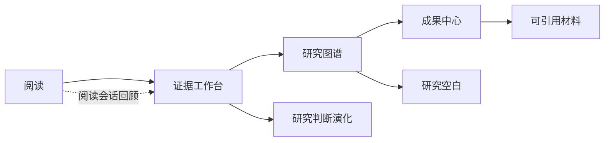

# Congnoscope研究环境 UI 与依据总契约

> 本文是产品叙事、研究依据、交互设计和工程验收之间的总契约。
> 它不替代 `UI_spec.md` 的组件级参数，也不直接授权改变已有数据模型。
> 当高层产品叙事与低层组件约定冲突时，先保留数据和路由兼容，再按本文的
> 页面责任、证据边界和验收条件调整 UI。

## 1. 设计结论

Congnoscope的核心不是搜索框、聊天框或论文关系图，而是一个以阅读为前台、以研究
沉淀为后台的本地优先科研环境。

用户的主要工作是：

```text
导入论文 -> 阅读 -> 批注 -> 回到原文核对 -> 比较证据 -> 形成判断 -> 输出材料
```

系统负责把阅读中的结构化痕迹沉淀为：

- 可回读的证据单元；
- 可比较的跨论文证据矩阵；
- 分层的研究图谱；
- 可审视的研究判断演化；
- 研究结论、局限、矛盾、研究空白和可引用材料。

系统不得把以下内容伪装成科学结论：

- 摄像头推断出的专注度；
- 没有原文定位的 AI 生成关系；
- 没有用户确认的摘要或综述；
- 没有方法和数据来源的相似性评分。

## 2. 设计读取与参数

**Design Read：**这是面向研究者的桌面优先研究工作台，视觉安静、学术、精确，
交互围绕原文和证据回读组织，不采用营销型首页或传统后台仪表盘。

| 参数 | 决策 | 解释 |
|---|---|---|
| `DESIGN_VARIANCE` | 5 | 通过分栏、时间线和矩阵建立层次，不用装饰性不对称 |
| `MOTION_INTENSITY` | 3 | 动效只表达状态变化、来源跳转和面板层级 |
| `VISUAL_DENSITY` | 5 | 支持长期研究工作，但不把页面做成数据驾驶舱 |

视觉禁用项：大面积紫色渐变、发光球体、漂移力导图、常驻摄像头画面、无限
循环动效、无来源的精确百分比、嵌套卡片和没有动作含义的装饰线。

## 3. 信息架构

### 3.1 四个研究空间



一级导航只保留：

1. 阅读
2. 证据
3. 图谱
4. 成果

文献库、回收站和设置属于辅助入口。首页使用“研究现场”这个产品概念，
但不作为统计报表页。

### 3.2 页面责任

| 页面 | 用户问题 | 页面必须给出的答案 |
|---|---|---|
| 研究现场 | 我现在研究到哪一步 | 当前研究问题、下一步、待审视事项 |
| 阅读 | 我要理解什么 | 原文、批注、局部证据和回读入口 |
| 证据 | 多篇论文到底如何支持或反驳 | 主张、原文、页码、条件和反例 |
| 图谱 | 这些内容如何关联 | 论文、主张、证据和研究空白的层级关系 |
| 成果 | 我能交付什么 | 结论、局限、空白、综述和引用材料 |

页面不能互相替代。图谱负责导航，证据工作台负责核对，成果中心负责输出。

## 4. 研究对象与来源边界

### 4.1 三层研究图谱

```text
论文
  ↓
研究主张
  ↓
证据、条件、反例、研究空白
```

下层四类对象是证据层的不同状态，不再增加“AI 推断层”作为事实层级。

### 4.2 证据单元

任何可以进入证据矩阵或成果中心的内容，至少需要：

- `fileId` 或稳定的论文标识；
- 页码、段落或可复现的文本定位；
- 原文摘录；
- 证据类型：支持、反驳、条件、局限、方法或数据；
- 来源状态：已核对、待核对、来源失效；
- 产生方式：用户创建、规则提取或 AI 建议。

AI 建议只能生成候选证据，不能绕过用户核对直接成为可复制材料。

### 4.3 来源生命周期

```text
候选 -> 待核对 -> 已核对 -> 可引用
                         ↘ 来源失效
```

论文软删除、原文定位失效或矩阵内容被修改时，相关材料回退到“待核对”，
不得静默保持“已核对”。

## 5. 功能依据矩阵

下表把产品动作、依据和工程落点绑定。依据解释的是为什么要有这个边界，
不是声称某个研究方法已经证明了产品效果。

| 功能或动作 | 设计依据 | UI 形式 | 工程验收 |
|---|---|---|---|
| 保存引用 | 科学主张需要与证据关联 | 划词工具栏中的“保存引用” | 保存原文、页码和定位，能回到原文 |
| 标记支持或反驳 | SciFact 将 claim 与 evidence 作为验证对象 | 证据矩阵单元格状态 | 状态可被用户修改并保留审计信息 |
| 标记条件和局限 | Cochrane 将偏倚拆成可解释领域，不使用单一神秘分数 | 条件、局限、待审视标签 | 每个标签都能打开来源和说明 |
| 研究判断演化 | PROV-O 支持实体、活动、派生和来源关系 | “研究判断演化”时间线 | 新判断保留父判断、触发证据和时间 |
| 图谱关系 | PROV-O 的来源关系和 VOSviewer 的网络浏览范式 | 三层稳定布局，右侧检查器 | 无来源的边显示为候选，不能直接输出为事实 |
| 综述流程 | PRISMA 强调检索、筛选、纳入和透明报告 | 文献簇、筛选状态、证据矩阵 | 记录选入论文及排除原因 |
| 阅读会话回顾 | 行为数据只能描述观测上下文 | 会话时间线和事件回放 | 不生成“理解度”或“科研质量”结论 |
| 本地摄像头 | 产品隐私边界要求推理在本地完成 | 阅读页只显示本地会话状态 | 服务不可用不阻断阅读；不上传画面 |
| 本地持久化 | IndexedDB 支持浏览器内持久化和离线查询 | 离线状态、保存状态、恢复提示 | 写入使用事务，失败有可恢复提示 |
| PDF 回读定位 | PDF.js 提供页级文本内容和渲染对象 | 点击来源后高亮并滚动到页码 | 版本升级后重新验证文本层和定位 |
| 动效 | WCAG 2.2 关注交互动画可停用，MDN 提供 `prefers-reduced-motion` | 状态过渡，不做连续装饰动画 | 减弱动效下不丢失状态和功能 |
| 键盘操作 | WCAG 2.2 Focus Visible | 2px 可见焦点环、焦点不自动消失 | 主要路径全程可键盘完成 |

## 6. 页面设计契约

### 6.1 研究现场

研究现场不使用四个同等指标卡。主视图使用三块有明确责任的工作区：

1. 当前研究问题和最近一次判断；
2. 最近阅读和可继续的论文；
3. 偏向冲突、证据不足和研究空白候选。

底部使用研究进展时间线：导入、阅读、批注、比较、判断收窄、成果输出。
页面首要动作是“继续当前研究”，其他动作降低权重。

### 6.2 阅读

默认进入沉浸阅读模式：

```text
论文目录 | 原文阅读区 | 可收起的批注与证据面板
```

顶部只保留返回、论文标题、页码、搜索、缩放、批注、书签和本地会话状态。
选中文字后出现短工具栏：保存引用、添加主张、标记方法、标记局限、标记反例、
添加问题、关联研究问题。

侧栏标签为：批注、证据、问题。每条批注显示原文、页码、论文和是否已经进入
证据链。点击“回到原文”必须恢复选中文本附近的上下文，而不是只跳到页面顶部。

### 6.3 证据工作台

采用三表面布局：

```text
主张列表 | 跨论文证据矩阵 | 来源检查器
```

矩阵行是研究主张，列是论文。单元格表达支持、反驳、条件化支持、未涉及和待
审核。颜色只承担语义，不能通过颜色单独传达状态。

来源检查器显示原文摘录、页码、上下文段落、用户批注、方法、数据集和“回到原文”。
矩阵中被修改的行，其引用材料和分析结果自动回退到待核对。

### 6.4 研究判断演化

不使用 Git 日志视觉，不展示 commit 或 branch。使用以下状态：

```text
草案 -> 有证据 -> 条件化 -> 出现反例 -> 当前判断 -> 待审视
```

详情页使用左右对比，变化文本通过底线或浅色标记显示。每个版本必须显示：

- 判断文本；
- 新增或删除的条件；
- 触发变化的论文；
- 支持证据和反例；
- 用户确认状态。

### 6.5 研究图谱

默认使用稳定的层级布局，不使用随机漂移的力导图。论文在上层，主张在中层，
证据、条件、反例和研究空白在下层。

筛选条件包括研究问题、论文、证据状态、方法、数据集和研究空白。选中节点后，
右侧检查器显示来源、关联证据、当前判断和回读入口。图谱是关系导航，不是引用
事实的最终出口。

### 6.6 成果中心

成果中心按以下顺序组织：

1. 研究结论与证据；
2. 局限与矛盾；
3. 研究空白与机会；
4. 跨论文综述；
5. 引用材料；
6. BibTeX 和 LaTeX。

每个成果块都必须保留“主张 -> 证据 -> 论文 -> 页码”的链条。没有完整链条的
内容只能复制为“待审核草稿”，不能标记为可引用。

## 7. 计算机视觉的边界

### 7.1 阅读中

只显示：

```text
本地阅读会话
已记录时长
暂停检测
```

不默认显示摄像头视频，不将实时事件作为阅读界面主视觉。

### 7.2 阅读结束后

使用“阅读会话回顾”展示：

- 阅读时段；
- 阅读过的页码；
- 批注时间点；
- 离开视线、看手机、聊天等事件的时间点；
- 会话开始和结束位置。

采用事实描述，例如“检测到 3 次离开视线”，不显示“理解度 82%”或“阅读质量 91%”。
CV 数据属于行为上下文层，不进入科学证据图谱，也不能触发研究主张版本更新。

## 8. 交互、视觉和动效规范

### 8.1 表面和布局

- 使用画布、分区、检查器和浮层四级表面；
- 卡片只用于独立重复项，不嵌套卡片；
- 主要层级由留白、边界线和字体权重表达；
- 圆角统一为小圆角，建议 6 到 8px；
- 保留现有 CSS token 体系和 `lucide-react` 图标体系；
- UI 使用清晰无衬线字体，论文内容保留原始阅读体验。

### 8.2 动效预算

| 场景 | 动效 | 目的 |
|---|---|---|
| 页面切换 | 淡入和轻微位移 | 说明上下文变化 |
| 侧栏打开 | 约 200ms 的 transform | 说明层级出现 |
| 回到原文 | 短暂高亮后恢复 | 证明来源跳转成功 |
| 判断更新 | 时间线节点顺序出现 | 说明证据改变了判断 |
| 图谱筛选 | 节点淡出，保持位置 | 保持空间记忆 |

禁止无限粒子、持续旋转、滚动劫持、摄像头常驻和无意义悬浮动画。所有动效在
`prefers-reduced-motion: reduce` 下退化为即时状态切换。

### 8.3 状态设计

所有异步功能都必须有：加载、空、成功、错误、离线和来源失效状态。加载态使用
与最终布局一致的骨架，不使用全屏旋转等待。错误信息要说明：发生了什么、数据
是否已经保存、用户可以如何恢复。

## 9. 无障碍与响应式验收

### 9.1 键盘和焦点

- 纯图标按钮必须有 `aria-label` 和 tooltip；
- 焦点环不依赖颜色单独表达；
- 抽屉、对话框和浮动工具栏必须有焦点管理和明确关闭动作；
- 键盘焦点不会因为自动动画而消失；
- 原文、矩阵和图谱都必须有列表化或表格化的可访问替代路径。

### 9.2 响应式

| 宽度 | 主要变化 |
|---|---|
| >= 1200px | 三表面布局，右侧检查器常驻 |
| 768px-1199px | 检查器改为可展开面板，矩阵保留横向滚动 |
| < 768px | 阅读单栏，证据和检查器改为底部抽屉，图谱改为层级列表 |

移动端不能通过缩小字体来容纳桌面布局。矩阵固定主张列，图谱保留列表化导航，
成果页优先展示可引用材料。

## 10. 工程约束

### 10.1 数据与路由

- 保留现有 React Router、Zustand、IndexedDB、PDF.js 和 EPUB 边界；
- 不新增 UI 框架或动画依赖；
- AI 请求不在组件内直接持有密钥；
- 跨 store 访问继续使用现有的 `getState()` 约定；
- 所有跨页面引用使用稳定 ID，不能依赖显示文本；
- 软删除必须传播到证据和分析状态，并撤销已核验状态。

### 10.2 性能

- 图谱布局和大文档处理不能阻塞主线程；
- PDF 连续滚动采用视口附近页的渐进渲染策略；
- 图谱筛选保持节点位置，避免全量随机重排；
- 只对 `transform` 和 `opacity` 做动画；
- 右侧检查器和大段 AI 内容按需渲染；
- 目标是保持现有应用的交互响应，不为了展示动效牺牲阅读流畅度。

### 10.3 隐私

- 摄像头推理和原始画面默认留在本地；
- UI 明确显示本地处理边界和服务不可用状态；
- 清除数据操作必须说明影响范围，并区分会话、批注、书签和 AI 配置；
- 任何向外部模型发送的文本上下文必须经过设置和用户动作授权。

## 11. 可执行验收清单

### 11.1 科学可追溯性

- [ ] 从矩阵单元格可以打开原文并落到页码或文本定位；
- [ ] 没有来源定位的关系显示为候选，不可直接进入可引用成果；
- [ ] 研究判断演化每个节点都能显示触发证据；
- [ ] 修改矩阵行后，相关成果回到待核对；
- [ ] 删除或失效来源后，核验状态会传播并给出解释；
- [ ] 结论、局限和研究空白都能分别查看来源。

### 11.2 阅读闭环

- [ ] 导入 PDF 或 EPUB 后可以完成阅读、划词、批注和书签；
- [ ] 阅读结束能看到会话回顾，但不会生成理解度或质量分数；
- [ ] monitor 不可用时仍然可以阅读和保存本地材料；
- [ ] 会话整理结果能回指批注和原文；
- [ ] 阅读页不被摄像头画面和 AI 面板抢夺主注意力。

### 11.3 工程和无障碍

- [ ] 浅色和深色主题层级一致，正文和焦点达到 WCAG AA 对比要求；
- [ ] `prefers-reduced-motion` 下没有持续动画或滚动劫持；
- [ ] 主路径可以只用键盘完成；
- [ ] IndexedDB 写入失败有恢复提示，事务不会留下半写状态；
- [ ] 390px、768px、1280px 三种视口没有横向溢出或遮挡；
- [ ] 真实 PDF 和 EPUB 数据下完成来源跳转、批注和矩阵回读验收。

## 12. 实施优先级

### P0

- 阅读页的证据化划词和来源回读；
- 证据矩阵三表面布局；
- 三层研究图谱和来源检查器；
- 成果中心的可引用材料块；
- 阅读会话回顾的事实表达。

### P1

- 研究判断演化；
- 偏向冲突和待审视线索；
- 方法、数据集和反例独立性检查；
- 图谱关系的人工确认状态；
- 完整离线、错误和来源失效状态。

### P2

- LaTeX 和目标期刊引用审计；
- 个人研究偏向的长期可视化；
- 研究红海和蓝海分析；
- 外部检索和下载能力；
- 多人协作和研究版本合并。

## 13. 依据、适用范围和版本说明

### 13.1 科学与研究方法依据

- [W3C PROV-O](https://www.w3.org/TR/prov-o/)：定义 Entity、Activity、Agent 及其派生和来源关系。它支持来源模型，不规定本产品的科学结论。
- [PRISMA 2020 statement](https://www.prisma-statement.org/prisma-2020)：提供系统综述的报告清单和流程图。它支持筛选和透明报告界面，不替代研究者的纳入判断。
- [Cochrane Risk of Bias](https://www.cochrane.org/learn/courses-and-resources/cochrane-methodology/risk-bias)：强调按领域评估偏倚和解释判断。本文因此使用局限、矛盾和待审视状态，不使用单一神秘分数。
- [Fact or Fiction: Verifying Scientific Claims](https://aclanthology.org/2020.emnlp-main.609/)：展示科学主张验证任务中的 claim、evidence 和 label 结构。该论文是研究依据，不是产品准确率保证。
- [OpenAlex documentation](https://docs.openalex.org/)：提供开放学术实体和关系的数据模型参考。本文只借鉴实体分层和关系浏览，不把外部图谱结果自动当作本地证据。
- [VOSviewer Getting Started](https://www.vosviewer.com/getting-started)：参考学术网络的缩放、筛选和聚焦式浏览。本文选择稳定布局，是为了保留用户对来源位置的空间记忆。

### 13.2 工程与可访问性依据

- [WCAG 2.2 Animation from Interactions](https://www.w3.org/WAI/WCAG22/Understanding/animation-from-interactions.html)：交互动画应可以被停用或避免非必要动画。该页面是 WCAG Understanding 文档，属于解释材料。
- [WCAG 2.2 Focus Visible](https://www.w3.org/WAI/WCAG22/Understanding/focus-visible.html)：键盘焦点需要持续可见。本文将焦点环和焦点管理作为 P0 验收项。
- [MDN `prefers-reduced-motion`](https://developer.mozilla.org/en-US/docs/Web/CSS/@media/prefers-reduced-motion)：浏览器可通过媒体特性表达用户减少非必要运动的偏好。
- [MDN Using IndexedDB](https://developer.mozilla.org/en-US/docs/Web/API/IndexedDB_API/Using_IndexedDB)：说明浏览器内持久化、查询和离线使用的 IndexedDB 基础。
- [PDF.js API documentation](https://mozilla.github.io/pdf.js/api/draft/module-pdfjsLib.html)：提供 PDF 页对象、文本内容和渲染相关 API 参考。当前仓库使用 `pdfjs-dist` `5.3.31`，升级时必须重新核对版本化 API。

### 13.3 版本风险

- W3C PROV-O 是稳定的规范文档，适合作为来源模型依据。
- PRISMA、Cochrane 和 SciFact 是研究方法或论文依据，不能直接证明 UI 能提高科研效率。
- WCAG Understanding 和 MDN 页面用于工程解释，正式发布前仍需按 WCAG 2.2 成功标准和实际浏览器行为验收。
- VOSviewer、OpenAlex 和 PDF.js 的网页内容可能更新，外部数据字段和 API 不能直接写死在 UI 契约中。

## 14. 设计决策记录

### 保留

- 研究主张版本化，改名为“研究判断演化”；
- 计算机视觉，但只作为阅读上下文；
- 分层个人研究图谱；
- 跨论文综述和证据矩阵；
- 研究结论、局限、矛盾和研究空白的分栏输出。

### 暂不扩大

- 不把搜索和下载作为本阶段的主叙事；
- 不把 AI 问答作为独立首页；
- 不把专注分数作为研究质量指标；
- 不把未经核对的图谱关系直接生成引用材料；
- 不增加多人协作、外部检索和期刊格式检查，直到本地文献闭环稳定。

### 主要拒绝理由

这些方向会扩大产品表面，但不能证明解决了评委提出的核心问题：用户在真实
科研过程中能否少切换、能否回到原文、能否得到可引用且可审查的研究材料。
